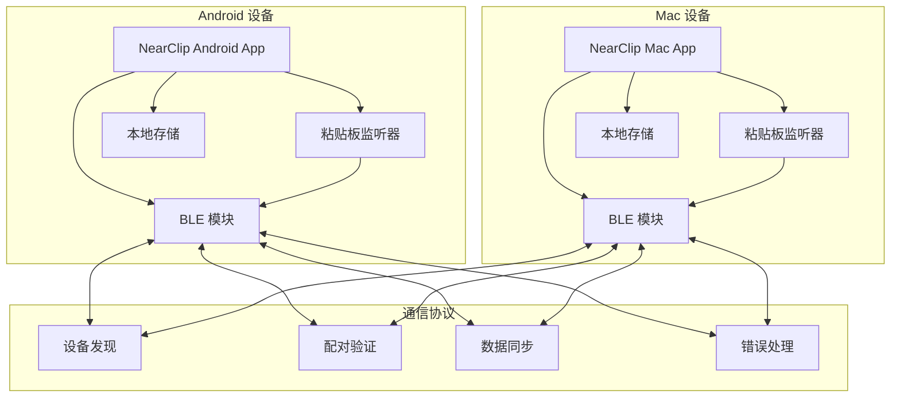
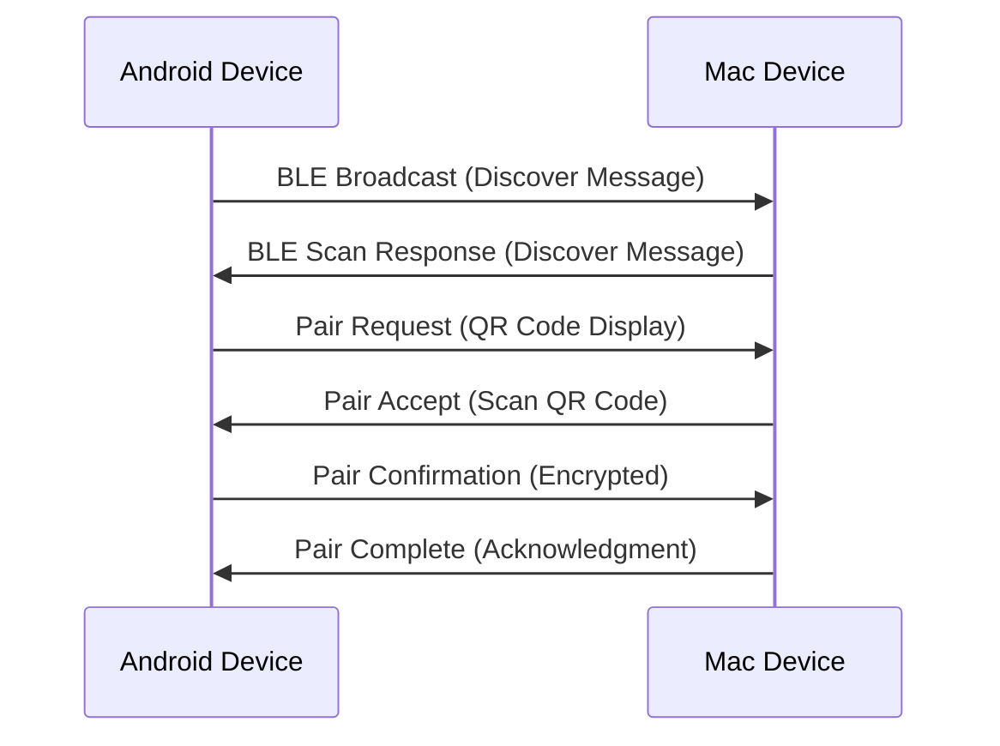
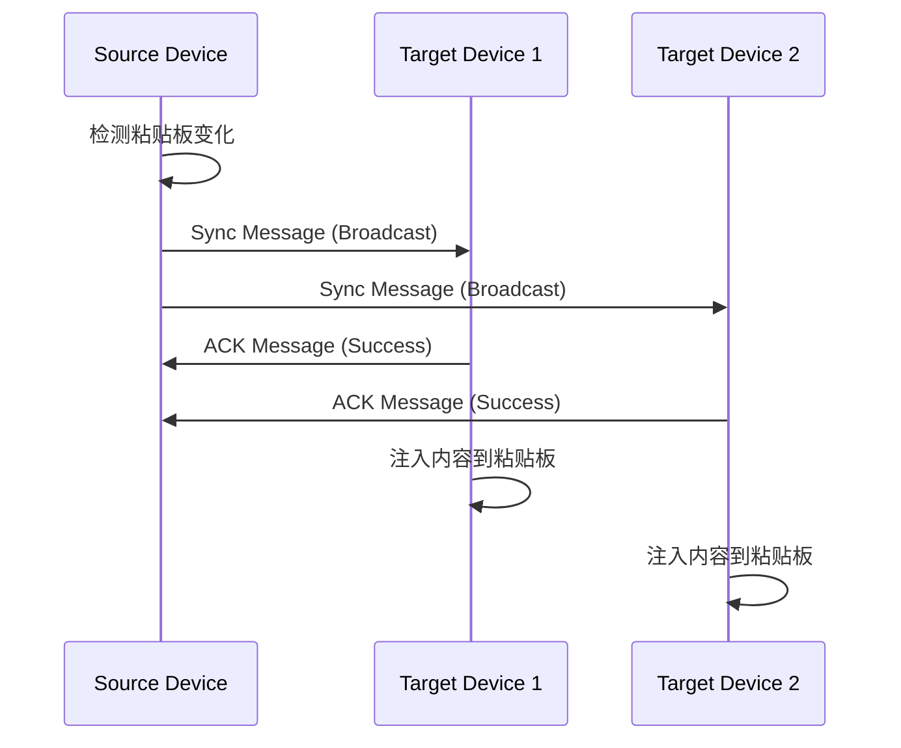
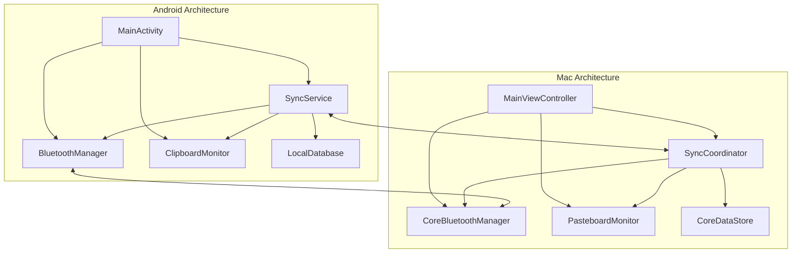
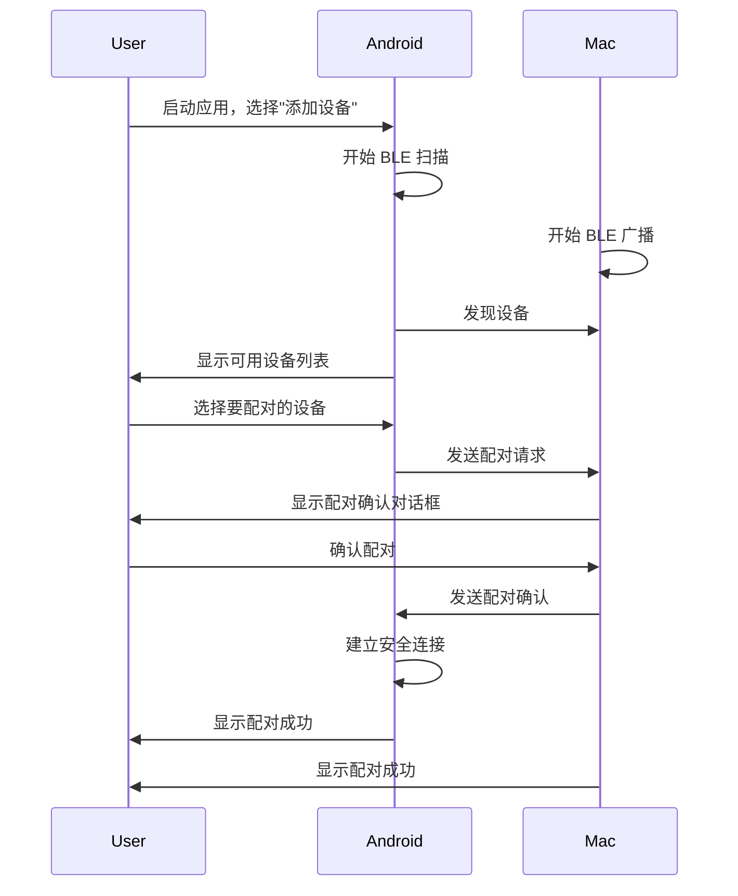
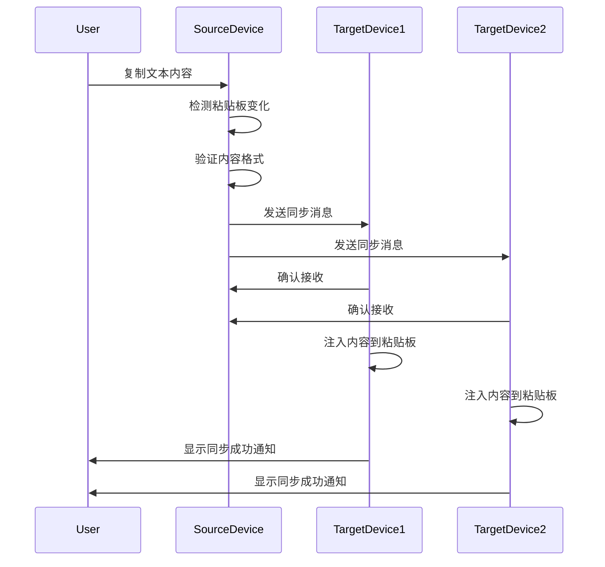
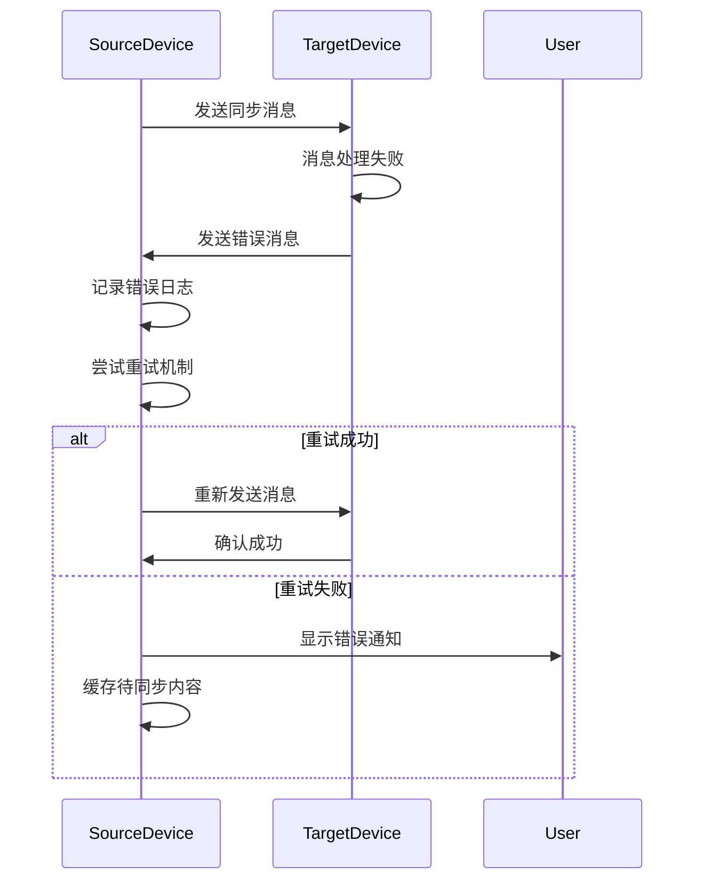
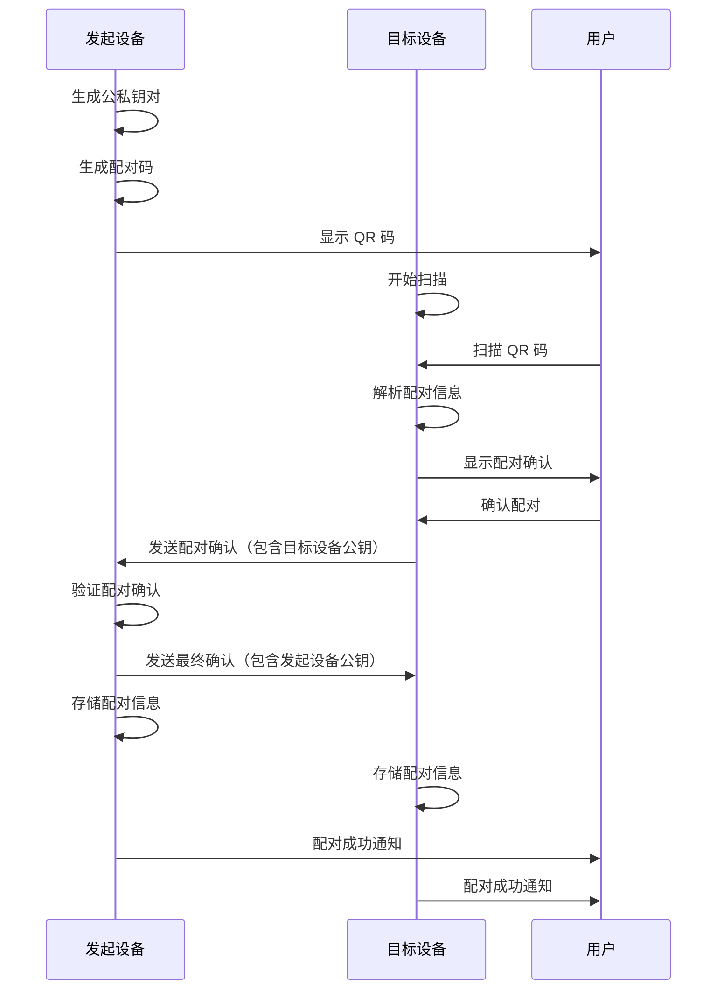
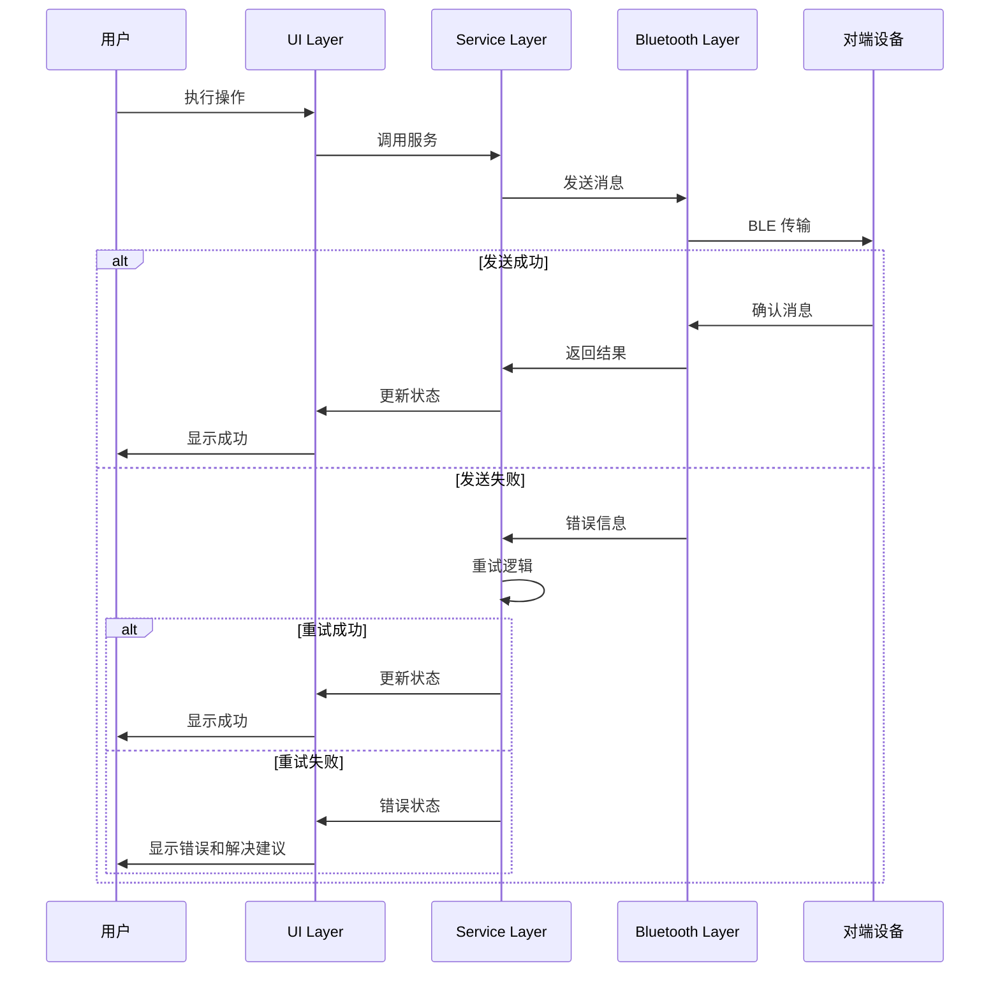

# NearClip 全栈架构文档

## 简介

本文档概述了 NearClip 项目的完整全栈架构，包括后端系统、前端实现以及它们的集成。该文档作为 AI 驱动开发的单一事实来源，确保整个技术栈的一致性。

这种统一的方法结合了传统上分离的后端和前端架构文档，为现代全栈应用程序简化了开发流程，在这些应用中，这些关注点日益紧密地交织在一起。

### 起始模板或现有项目

N/A - 这是一个绿地项目，从零开始构建。

### 变更日志

| 日期 | 版本 | 描述 | 作者 |
|------|------|------|------|
| 2025-01-15 | 1.0 | 初始架构文档版本，基于 PRD 和前端规范创建 | Winston (BMAD Architect) |

## 高层次架构

### 技术摘要

NearClip 采用去中心化的 P2P 架构，使用 BLE（低功耗蓝牙）作为主要通信协议，WiFi Direct 作为备用方案。系统基于 Kotlin（Android）和 Swift（macOS）的原生开发，通过标准化的 JSON 协议实现设备间的安全数据同步。Monorepo 结构便于共享核心通信协议和测试工具，确保跨平台一致性。

### 平台和基础设施选择

**平台：** 本地 P2P 通信，无云服务依赖
**核心服务：** BLE 广播/扫描、WiFi Direct、本地加密存储
**部署主机和区域：** 本地设备部署，无地理限制

### 仓库结构

**结构：** Monorepo
**Monorepo 工具：** 原生 Git + 共享协议目录
**包组织：** 按平台分离的目录结构，共享核心通信协议

### 高层次架构图



### 架构模式

- **P2P 去中心化架构**：无中心服务器，每个设备既是客户端也是服务端 - _理由：_ 符合隐私优先原则，避免单点故障
- **事件驱动通信**：基于粘贴板变化事件的自动同步机制 - _理由：_ 实现无感知同步的用户体验
- **状态机模式**：设备连接状态的精确管理 - _理由：_ 确保连接稳定性和错误恢复
- **策略模式**：BLE/WiFi Direct 通信协议的动态选择 - _理由：_ 根据设备能力和环境条件优化连接质量
- **观察者模式**：粘贴板变化的监听和通知 - _理由：_ 实现实时的内容捕获和同步
- **工厂模式**：跨平台消息的标准化创建 - _理由：_ 确保不同平台间的消息格式一致性

## 技术栈

### 技术栈表

| 类别 | 技术 | 版本 | 用途 | 理由 |
|------|------|------|------|------|
| Android 语言 | Kotlin | 1.9.20 | 主要开发语言 | 类型安全、与 Java 互操作、Google 官方支持 |
| Android 框架 | Jetpack Compose | 1.5.4 | 现代声明式 UI | 简化 UI 开发、状态管理、动画支持 |
| Mac 语言 | Swift | 5.9 | 主要开发语言 | 类型安全、性能优秀、Apple 生态系统原生支持 |
| Mac 框架 | SwiftUI | 5.0 | 声明式 UI 框架 | 现代、响应式、与 Swift 深度集成 |
| UI 组件库 | 原生组件 | - | UI 实现 | 平台一致性、性能最优、系统集成度高 |
| 状态管理 | ViewModel + StateFlow | - | Android 状态管理 | 生命周期感知、响应式、架构一致性 |
| API 风格 | BLE 协议 | 5.0+ | 设备间通信 | 低功耗、广泛支持、近场通信优化 |
| 数据库 | Room (Android) | 2.5.0 | 本地数据存储 | 类型安全、SQLite 抽象、迁移支持 |
| 缓存 | Core Data (Mac) | - | 本地数据存储 | Apple 生态原生、性能优化 |
| 文件存储 | SharedPreferences | - | 配置存储 | 简单键值对存储、平台原生 |
| 认证 | 公钥加密 | - | 设备配对验证 | 无需中心化认证、安全性高、隐私保护 |
| 前端测试 | JUnit + Espresso | 4.13.2 | Android 测试 | 标准测试框架、UI 测试支持 |
| 后端测试 | XCTest | - | Mac 测试 | Apple 官方测试框架、集成度高 |
| E2E 测试 | 自定义测试工具 | - | 跨设备测试 | 特定协议测试、设备模拟 |
| 构建工具 | Gradle (Android) | 8.0 | 构建系统 | 灵活性高、依赖管理、多模块支持 |
| 打包工具 | Xcode Build | - | Mac 构建 | Apple 官方、优化深度、签名集成 |
| IaC 工具 | - | - | 基础设施 | 本地应用无需基础设施即代码 |
| CI/CD | GitHub Actions | - | 自动化构建 | 集成度高、免费额度、跨平台支持 |
| 监控 | 自定义日志系统 | - | 应用监控 | 轻量级、隐私保护、本地存储 |
| 日志 | 平台原生日志 | - | 调试和监控 | 系统集成、性能优化、开发者友好 |
| CSS 框架 | - | - | 不适用 | 原生应用无需 CSS |

## 数据模型

### Device 设备模型

**目的：** 表示 NearClip 网络中的设备信息，包括设备标识、能力和连接状态。

**关键属性：**
- deviceId: String - 设备唯一标识符
- deviceName: String - 用户友好的设备名称
- deviceType: DeviceType - 设备类型（Android/Mac）
- publicKey: String - 设备公钥，用于加密验证
- lastSeen: Timestamp - 最后在线时间
- connectionStatus: ConnectionStatus - 连接状态

#### TypeScript 接口

```typescript
interface Device {
  deviceId: string;
  deviceName: string;
  deviceType: 'android' | 'mac';
  publicKey: string;
  lastSeen: number;
  connectionStatus: 'connected' | 'disconnected' | 'pairing' | 'error';
}

enum DeviceType {
  ANDROID = 'android',
  MAC = 'mac'
}

enum ConnectionStatus {
  CONNECTED = 'connected',
  DISCONNECTED = 'disconnected',
  PAIRING = 'pairing',
  ERROR = 'error'
}
```

#### 关系关系

- Device 1:n SyncRecord - 设备可以有多个同步记录
- Device 1:n PairingRequest - 设备可以发起或接收多个配对请求

### SyncRecord 同步记录模型

**目的：** 记录粘贴板同步操作的详细信息，用于冲突解决和历史追踪。

**Key Attributes:**
- syncId: String - 同步操作唯一标识符
- sourceDeviceId: String - 源设备 ID
- content: String - 同步的文本内容
- contentType: ContentType - 内容类型（文本/链接）
- timestamp: Timestamp - 同步时间戳
- status: SyncStatus - 同步状态

#### TypeScript 接口

```typescript
interface SyncRecord {
  syncId: string;
  sourceDeviceId: string;
  targetDeviceIds: string[];
  content: string;
  contentType: 'text' | 'url';
  timestamp: number;
  status: 'pending' | 'completed' | 'failed';
}

enum ContentType {
  TEXT = 'text',
  URL = 'url'
}

enum SyncStatus {
  PENDING = 'pending',
  COMPLETED = 'completed',
  FAILED = 'failed'
}
```

#### 关系关系

- SyncRecord n:1 Device - 同步记录关联到源设备和目标设备

### PairingRequest 配对请求模型

**目的：** 管理设备配对过程中的请求和验证信息。

**Key Attributes:**
- requestId: String - 配对请求唯一标识符
- initiatorDeviceId: String - 发起配对的设备 ID
- targetDeviceId: String - 目标设备 ID
- pairingCode: String - 配对码或 QR 码内容
- timestamp: Timestamp - 请求时间戳
- status: PairingStatus - 配对状态

#### TypeScript 接口

```typescript
interface PairingRequest {
  requestId: string;
  initiatorDeviceId: string;
  targetDeviceId: string;
  pairingCode: string;
  timestamp: number;
  status: 'pending' | 'accepted' | 'rejected' | 'expired';
}

enum PairingStatus {
  PENDING = 'pending',
  ACCEPTED = 'accepted',
  REJECTED = 'rejected',
  EXPIRED = 'expired'
}
```

#### 关系关系

- PairingRequest 1:1 Device - 配对请求关联到发起设备和目标设备

## API 规范

### BLE 通信协议规范

由于 NearClip 使用 BLE 而非传统 REST API，这里定义设备间的 BLE 通信协议：

#### 消息格式标准

```yaml
# 基础消息结构
message:
  version: "1.0"
  type: "discover|pair|sync|ack|error"
  deviceId: "string"
  timestamp: "unix_timestamp"
  payload: "object"

# 设备发现消息
discover_message:
  type: "discover"
  deviceId: "device_unique_id"
  payload:
    deviceName: "string"
    deviceType: "android|mac"
    capabilities: ["ble", "wifi_direct"]

# 配对请求消息
pair_request:
  type: "pair"
  deviceId: "initiator_device_id"
  payload:
    targetDeviceId: "target_device_id"
    pairingCode: "qr_code_or_manual_code"
    publicKey: "device_public_key"

# 数据同步消息
sync_message:
  type: "sync"
  deviceId: "source_device_id"
  payload:
    content: "synchronized_text_or_url"
    contentType: "text|url"
    syncId: "unique_sync_identifier"
    targetDevices: ["device_id_list"]

# 确认消息
ack_message:
  type: "ack"
  deviceId: "responder_device_id"
  payload:
    originalMessageId: "message_id_to_acknowledge"
    status: "success|error"
    errorCode: "error_code_if_applicable"

# 错误消息
error_message:
  type: "error"
  deviceId: "sender_device_id"
  payload:
    errorCode: "ERROR_CODE"
    errorMessage: "human_readable_error_message"
    originalMessageId: "failed_message_id"
```

#### 设备发现流程



#### 数据同步流程



## 组件

### Android 端组件

#### BluetoothManager

**职责：** 管理 Android 设备的 BLE 功能，包括设备扫描、广播、连接管理。

**关键接口：**
- startDiscovery(): Promise<Device[]>
- startAdvertising(): Promise<void>
- connectToDevice(deviceId: string): Promise<void>
- disconnectFromDevice(deviceId: Promise<void>

**依赖：** Android BLE API
**技术栈：** Kotlin + BluetoothAdapter + BluetoothLeScanner

#### ClipboardMonitor

**职责：** 监听系统粘贴板变化，捕获新的文本内容。

**关键接口：**
- startMonitoring(): void
- stopMonitoring(): void
- getCurrentContent(): Promise<string>
- onContentChanged: Callback<string>

**依赖：** Android ClipboardManager
**技术栈：** Kotlin + ClipboardManager + ContentObserver

#### SyncService

**职责：** 处理跨设备数据同步逻辑，包括消息发送、接收和冲突解决。

**关键接口：**
- broadcastSync(content: string, targets: Device[]): Promise<void>
- handleSyncMessage(message: SyncMessage): Promise<void>
- resolveConflict(conflicts: SyncRecord[]): SyncRecord

**依赖：** BluetoothManager, LocalStorage
**技术栈：** Kotlin + Coroutines + Room Database

### Mac 端组件

#### CoreBluetoothManager

**职责：** 管理 macOS 设备的 BLE 功能，实现与 Android 端对应的通信能力。

**关键接口：**
- startScanning(): Promise<Device[]>
- startAdvertising(): Promise<void>
- connectToPeripheral(deviceId: string): Promise<void>
- disconnectPeripheral(deviceId: string): Promise<void>

**依赖：** Core Bluetooth 框架
**技术栈：** Swift + CoreBluetooth + CBCentralManager

#### PasteboardMonitor

**职责：** 监听系统粘贴板变化，与 Android 端保持一致的监听逻辑。

**关键接口：**
- startMonitoring(): void
- stopMonitoring(): void
- getCurrentContent(): Promise<string>
- onContentChanged: Callback<string>

**依赖：** NSPasteboard
**技术栈：** Swift + NSPasteboard + NSNotificationCenter

#### SyncCoordinator

**职责：** 协调 Mac 端的同步操作，管理与 Android 端的数据交换。

**关键接口：**
- handleIncomingSync(message: SyncMessage): Promise<void>
- initiateSync(content: string): Promise<void>
- manageSyncHistory(): SyncRecord[]

**依赖：** CoreBluetoothManager, Core Data
**技术栈：** Swift + Core Data + Combine Framework

### 组件图



## 外部 API

NearClip 设计为完全本地化，不依赖外部 API 或云服务，确保用户数据的隐私和安全。

### 系统级 API 依赖

- Android Bluetooth API - 用于 BLE 通信
- Core Bluetooth Framework (macOS) - 用于 macOS BLE 通信
- Android ClipboardManager - 系统粘贴板访问
- NSPasteboard (macOS) - macOS 系统粘贴板访问

所有依赖都是操作系统原生 API，无需第三方服务。

## 核心工作流

### 设备配对工作流



### 粘贴板同步工作流



### 错误处理工作流



## 数据库架构

### Android Room 数据库架构

```sql
-- 设备表
CREATE TABLE devices (
    device_id TEXT PRIMARY KEY,
    device_name TEXT NOT NULL,
    device_type TEXT NOT NULL CHECK (device_type IN ('android', 'mac')),
    public_key TEXT NOT NULL,
    last_seen INTEGER NOT NULL,
    connection_status TEXT NOT NULL DEFAULT 'disconnected',
    created_at INTEGER NOT NULL DEFAULT (strftime('%s', 'now')),
    updated_at INTEGER NOT NULL DEFAULT (strftime('%s', 'now'))
);

-- 同步记录表
CREATE TABLE sync_records (
    sync_id TEXT PRIMARY KEY,
    source_device_id TEXT NOT NULL,
    content TEXT NOT NULL,
    content_type TEXT NOT NULL CHECK (content_type IN ('text', 'url')),
    timestamp INTEGER NOT NULL,
    status TEXT NOT NULL DEFAULT 'pending',
    FOREIGN KEY (source_device_id) REFERENCES devices(device_id)
);

-- 设备同步关联表
CREATE TABLE device_sync_targets (
    id INTEGER PRIMARY KEY AUTOINCREMENT,
    sync_id TEXT NOT NULL,
    target_device_id TEXT NOT NULL,
    status TEXT NOT NULL DEFAULT 'pending',
    FOREIGN KEY (sync_id) REFERENCES sync_records(sync_id),
    FOREIGN KEY (target_device_id) REFERENCES devices(device_id),
    UNIQUE(sync_id, target_device_id)
);

-- 配对请求表
CREATE TABLE pairing_requests (
    request_id TEXT PRIMARY KEY,
    initiator_device_id TEXT NOT NULL,
    target_device_id TEXT NOT NULL,
    pairing_code TEXT NOT NULL,
    timestamp INTEGER NOT NULL,
    status TEXT NOT NULL DEFAULT 'pending',
    expires_at INTEGER NOT NULL,
    FOREIGN KEY (initiator_device_id) REFERENCES devices(device_id),
    FOREIGN KEY (target_device_id) REFERENCES devices(device_id)
);

-- 索引
CREATE INDEX idx_devices_last_seen ON devices(last_seen);
CREATE INDEX idx_sync_records_timestamp ON sync_records(timestamp);
CREATE INDEX idx_pairing_requests_timestamp ON pairing_requests(timestamp);
CREATE INDEX idx_pairing_requests_status ON pairing_requests(status);
```

### macOS Core Data 模型

```swift
// 设备实体
@objc(Device)
public class Device: NSManagedObject {
    @NSManaged public var deviceId: String
    @NSManaged public var deviceName: String
    @NSManaged public var deviceType: String
    @NSManaged public var publicKey: String
    @NSManaged public var lastSeen: Date
    @NSManaged public var connectionStatus: String
    @NSManaged public var createdAt: Date
    @NSManaged public var updatedAt: Date
    @NSManaged public var syncRecords: NSSet?
    @NSManaged public var pairingRequests: NSSet?
}

// 同步记录实体
@objc(SyncRecord)
public class SyncRecord: NSManagedObject {
    @NSManaged public var syncId: String
    @NSManaged public var sourceDevice: Device
    @NSManaged public var content: String
    @NSManaged public var contentType: String
    @NSManaged public var timestamp: Date
    @NSManaged public var status: String
    @NSManaged public var targetDevices: NSSet?
}

// 配对请求实体
@objc(PairingRequest)
public class PairingRequest: NSManagedObject {
    @NSManaged public var requestId: String
    @NSManaged public var initiatorDevice: Device
    @NSManaged public var targetDevice: Device
    @NSManaged public var pairingCode: String
    @NSManaged public var timestamp: Date
    @NSManaged public var status: String
    @NSManaged public var expiresAt: Date
}
```

## 前端架构

### 组件架构

#### Android Compose 组件组织

```
app/src/main/java/com/nearclip/
├── ui/
│   ├── components/
│   │   ├── DeviceCard.kt
│   │   ├── StatusIndicator.kt
│   │   ├── QRCodeDisplay.kt
│   │   └── SyncProgressBar.kt
│   ├── screens/
│   │   ├── HomeScreen.kt
│   │   ├── DeviceDiscoveryScreen.kt
│   │   ├── DeviceManagementScreen.kt
│   │   └── SettingsScreen.kt
│   ├── theme/
│   │   ├── Color.kt
│   │   ├── Theme.kt
│   │   └── Type.kt
│   └── navigation/
│       └── Navigation.kt
```

#### 组件模板

```kotlin
@Composable
fun DeviceCard(
    device: Device,
    onConnect: (String) -> Unit,
    onDisconnect: (String) -> Unit,
    modifier: Modifier = Modifier
) {
    Card(
        modifier = modifier
            .fillMaxWidth()
            .padding(horizontal = 16.dp, vertical = 8.dp),
        elevation = CardDefaults.cardElevation(defaultElevation = 4.dp)
    ) {
        Row(
            modifier = Modifier
                .fillMaxWidth()
                .padding(16.dp),
            verticalAlignment = Alignment.CenterVertically
        ) {
            // 设备图标
            Icon(
                imageVector = when (device.deviceType) {
                    "android" -> Icons.Default.Android
                    "mac" -> Icons.Default.Computer
                    else -> Icons.Default.DeviceUnknown
                },
                contentDescription = null,
                modifier = Modifier.size(48.dp),
                tint = when (device.connectionStatus) {
                    "connected" -> MaterialTheme.colorScheme.primary
                    "disconnected" -> MaterialTheme.colorScheme.onSurfaceVariant
                    else -> MaterialTheme.colorScheme.tertiary
                }
            )

            Spacer(modifier = Modifier.width(16.dp))

            // 设备信息
            Column(modifier = Modifier.weight(1f)) {
                Text(
                    text = device.deviceName,
                    style = MaterialTheme.typography.titleMedium
                )
                Text(
                    text = "${device.deviceType.uppercase()} • ${getRelativeTimeString(device.lastSeen)}",
                    style = MaterialTheme.typography.bodyMedium,
                    color = MaterialTheme.colorScheme.onSurfaceVariant
                )
            }

            // 连接状态和操作按钮
            when (device.connectionStatus) {
                "connected" -> {
                    IconButton(onClick = { onDisconnect(device.deviceId) }) {
                        Icon(
                            imageVector = Icons.Default.BluetoothConnected,
                            contentDescription = "Disconnect"
                        )
                    }
                }
                "disconnected" -> {
                    OutlinedButton(
                        onClick = { onConnect(device.deviceId) }
                    ) {
                        Text("Connect")
                    }
                }
                else -> {
                    CircularProgressIndicator(
                        modifier = Modifier.size(24.dp),
                        strokeWidth = 2.dp
                    )
                }
            }
        }
    }
}
```

### 状态管理架构

#### 状态结构

```kotlin
data class NearClipUiState(
    val connectedDevices: List<Device> = emptyList(),
    val discoveredDevices: List<Device> = emptyList(),
    val isScanning: Boolean = false,
    val isAdvertising: Boolean = false,
    val lastSyncStatus: SyncStatus? = null,
    val errorMessage: String? = null,
    val isLoading: Boolean = false
) {
    val hasConnectedDevices: Boolean
        get() = connectedDevices.isNotEmpty()

    val canSync: Boolean
        get() = hasConnectedDevices && !isLoading
}
```

#### 状态管理模式

```kotlin
class NearClipViewModel : ViewModel() {
    private val _uiState = MutableStateFlow(NearClipUiState())
    val uiState: StateFlow<NearClipUiState> = _uiState.asStateFlow()

    private val bluetoothManager: BluetoothManager = TODO()
    private val syncService: SyncService = TODO()

    fun startDeviceDiscovery() {
        viewModelScope.launch {
            _uiState.update { it.copy(isScanning = true) }

            bluetoothManager.startDiscovery()
                .catch { error ->
                    _uiState.update {
                        it.copy(
                            isScanning = false,
                            errorMessage = "设备发现失败: ${error.message}"
                        )
                    }
                }
                .collect { devices ->
                    _uiState.update {
                        it.copy(
                            discoveredDevices = devices,
                            isScanning = false
                        )
                    }
                }
        }
    }

    fun connectToDevice(deviceId: String) {
        viewModelScope.launch {
            _uiState.update { it.copy(isLoading = true) }

            try {
                bluetoothManager.connectToDevice(deviceId)
                _uiState.update {
                    it.copy(
                        isLoading = false,
                        errorMessage = null
                    )
                }
            } catch (error: Exception) {
                _uiState.update {
                    it.copy(
                        isLoading = false,
                        errorMessage = "连接失败: ${error.message}"
                    )
                }
            }
        }
    }
}
```

### 路由架构

#### 路由组织

```kotlin
sealed class Screen(val route: String) {
    object Home : Screen("home")
    object DeviceDiscovery : Screen("discovery")
    object DeviceManagement : Screen("management")
    object Settings : Screen("settings")
    object QRCode : Screen("qrcode")
}

@Composable
fun NearClipNavigation(
    navController: NavHostController = rememberNavController()
) {
    NavHost(
        navController = navController,
        startDestination = Screen.Home.route
    ) {
        composable(Screen.Home.route) {
            HomeScreen(
                onNavigateToDiscovery = {
                    navController.navigate(Screen.DeviceDiscovery.route)
                },
                onNavigateToManagement = {
                    navController.navigate(Screen.DeviceManagement.route)
                },
                onNavigateToSettings = {
                    navController.navigate(Screen.Settings.route)
                }
            )
        }

        composable(Screen.DeviceDiscovery.route) {
            DeviceDiscoveryScreen(
                onNavigateBack = { navController.popBackStack() },
                onNavigateToQRCode = {
                    navController.navigate(Screen.QRCode.route)
                }
            )
        }

        composable(Screen.QRCode.route) {
            QRCodeScreen(
                onNavigateBack = { navController.popBackStack() }
            )
        }
    }
}
```

### 前端服务层

#### API 客户端设置

```kotlin
class BluetoothServiceImpl : BluetoothService {
    private val bluetoothAdapter: BluetoothAdapter? = TODO()
    private val bleScanner: BluetoothLeScanner? = TODO()
    private val gattCallback = object : BluetoothGattCallback() {
        override fun onConnectionStateChange(gatt: BluetoothGatt, status: Int, newState: Int) {
            when (newState) {
                BluetoothProfile.STATE_CONNECTED -> {
                    // 处理连接成功
                }
                BluetoothProfile.STATE_DISCONNECTED -> {
                    // 处理连接断开
                }
            }
        }

        override fun onCharacteristicRead(
            gatt: BluetoothGatt,
            characteristic: BluetoothGattCharacteristic,
            status: Int
        ) {
            // 处理特征值读取
        }

        override fun onCharacteristicWrite(
            gatt: BluetoothGatt,
            characteristic: BluetoothGattCharacteristic,
            status: Int
        ) {
            // 处理特征值写入
        }
    }

    override suspend fun startDiscovery(): Flow<Device> = callbackFlow {
        val scanCallback = object : ScanCallback() {
            override fun onScanResult(callbackType: Int, result: ScanResult) {
                val device = mapScanResultToDevice(result)
                trySend(device)
            }
        }

        bleScanner?.startScan(scanCallback)

        awaitClose {
            bleScanner?.stopScan(scanCallback)
        }
    }

    override suspend fun connectToDevice(device: Device): Boolean {
        return suspendCoroutine { continuation ->
            val bluetoothDevice = bluetoothAdapter?.getRemoteDevice(device.deviceId)
            bluetoothDevice?.connectGatt(context, false, gattCallback)
                ?.let { gatt ->
                    // 处理连接结果
                    continuation.resume(true)
                } ?: continuation.resume(false)
        }
    }
}
```

#### 服务示例

```kotlin
class SyncServiceImpl(
    private val bluetoothService: BluetoothService,
    private val storageService: StorageService
) : SyncService {

    override suspend fun broadcastSync(
        content: String,
        targetDevices: List<Device>
    ): Result<Unit> {
        return try {
            val syncMessage = SyncMessage(
                syncId = UUID.randomUUID().toString(),
                sourceDeviceId = getCurrentDeviceId(),
                content = content,
                contentType = detectContentType(content),
                timestamp = System.currentTimeMillis(),
                targetDevices = targetDevices.map { it.deviceId }
            )

            // 存储同步记录
            storageService.saveSyncRecord(syncMessage)

            // 广播到所有目标设备
            targetDevices.forEach { device ->
                bluetoothService.sendMessage(device, syncMessage)
            }

            Result.success(Unit)
        } catch (error: Exception) {
            Result.failure(error)
        }
    }

    override suspend fun handleIncomingSync(message: SyncMessage): Result<Unit> {
        return try {
            // 验证消息来源
            if (!isValidSource(message.sourceDeviceId)) {
                return Result.failure(SecurityException("Unknown device"))
            }

            // 注入到粘贴板
            injectToClipboard(message.content)

            // 确认接收
            val ackMessage = AckMessage(
                originalMessageId = message.syncId,
                deviceId = getCurrentDeviceId(),
                status = "success"
            )

            bluetoothService.sendMessage(
                getDeviceById(message.sourceDeviceId)!!,
                ackMessage
            )

            Result.success(Unit)
        } catch (error: Exception) {
            Result.failure(error)
        }
    }
}
```

## 后端架构

### 服务架构

由于 NearClip 采用 P2P 架构，每个设备都同时作为客户端和服务端运行。以下是设备端的服务架构：

#### 函数组织

```
android/src/main/java/com/nearclip/services/
├── bluetooth/
│   ├── BluetoothManager.kt
│   ├── GattServerManager.kt
│   └── MessageHandler.kt
├── sync/
│   ├── SyncService.kt
│   ├── ConflictResolver.kt
│   └── SyncQueueManager.kt
├── security/
│   ├── EncryptionService.kt
│   ├── KeyManager.kt
│   └── DeviceAuthenticator.kt
└── storage/
    ├── DatabaseService.kt
    └── PreferencesService.kt
```

#### 函数模板

```kotlin
class GattServerManager(
    private val context: Context,
    private val messageHandler: MessageHandler
) {
    private val bluetoothManager: BluetoothManager = context.getSystemService(Context.BLUETOOTH_SERVICE) as BluetoothManager
    private val bluetoothAdapter: BluetoothAdapter? = bluetoothManager.adapter
    private var gattServer: BluetoothGattServer? = null

    private val gattServerCallback = object : BluetoothGattServerCallback() {
        override fun onConnectionStateChange(device: BluetoothDevice, status: Int, newState: Int) {
            when (newState) {
                BluetoothProfile.STATE_CONNECTED -> {
                    Log.d(TAG, "Device connected: ${device.address}")
                    handleDeviceConnected(device)
                }
                BluetoothProfile.STATE_DISCONNECTED -> {
                    Log.d(TAG, "Device disconnected: ${device.address}")
                    handleDeviceDisconnected(device)
                }
            }
        }

        override fun onCharacteristicReadRequest(
            device: BluetoothDevice,
            requestId: Int,
            offset: Int,
            characteristic: BluetoothGattCharacteristic
        ) {
            handleReadRequest(device, requestId, characteristic)
        }

        override fun onCharacteristicWriteRequest(
            device: BluetoothDevice,
            requestId: Int,
            characteristic: BluetoothGattCharacteristic,
            preparedWrite: Boolean,
            responseNeeded: Boolean,
            offset: Int,
            value: ByteArray
        ) {
            handleWriteRequest(device, requestId, characteristic, value)
        }
    }

    suspend fun startServer(): Result<Unit> = suspendCoroutine { continuation ->
        gattServer = bluetoothAdapter?.openGattServer(context, gattServerCallback)

        gattServer?.let { server ->
            val service = BluetoothGattService(SERVICE_UUID, BluetoothGattService.SERVICE_TYPE_PRIMARY)

            // 添加同步特征
            val syncCharacteristic = BluetoothGattCharacteristic(
                SYNC_CHARACTERISTIC_UUID,
                BluetoothGattCharacteristic.PROPERTY_WRITE or BluetoothGattCharacteristic.PROPERTY_READ,
                BluetoothGattCharacteristic.PERMISSION_WRITE or BluetoothGattCharacteristic.PERMISSION_READ
            )
            service.addCharacteristic(syncCharacteristic)

            // 添加设备信息特征
            val deviceInfoCharacteristic = BluetoothGattCharacteristic(
                DEVICE_INFO_CHARACTERISTIC_UUID,
                BluetoothGattCharacteristic.PROPERTY_READ,
                BluetoothGattCharacteristic.PERMISSION_READ
            )
            service.addCharacteristic(deviceInfoCharacteristic)

            server.addService(service)
            continuation.resume(Result.success(Unit))
        } ?: continuation.resume(Result.failure(Exception("Failed to start GATT server")))
    }

    private fun handleWriteRequest(
        device: BluetoothDevice,
        requestId: Int,
        characteristic: BluetoothGattCharacteristic,
        value: ByteArray
    ) {
        when (characteristic.uuid) {
            SYNC_CHARACTERISTIC_UUID -> {
                val message = MessageParser.parseMessage(value)
                messageHandler.handleIncomingMessage(device, message)

                gattServer?.sendResponse(
                    device,
                    requestId,
                    BluetoothGatt.GATT_SUCCESS,
                    0,
                    null
                )
            }
            else -> {
                gattServer?.sendResponse(
                    device,
                    requestId,
                    BluetoothGatt.GATT_FAILURE,
                    0,
                    null
                )
            }
        }
    }
}
```

### 数据库架构

#### 模式设计

```sql
-- 设备表
CREATE TABLE devices (
    device_id TEXT PRIMARY KEY,
    device_name TEXT NOT NULL,
    device_type TEXT NOT NULL CHECK (device_type IN ('android', 'mac')),
    public_key TEXT NOT NULL UNIQUE,
    last_seen INTEGER NOT NULL DEFAULT (strftime('%s', 'now')),
    connection_status TEXT NOT NULL DEFAULT 'disconnected',
    is_trusted INTEGER NOT NULL DEFAULT 0,
    created_at INTEGER NOT NULL DEFAULT (strftime('%s', 'now')),
    updated_at INTEGER NOT NULL DEFAULT (strftime('%s', 'now'))
);

-- 同步记录表
CREATE TABLE sync_records (
    sync_id TEXT PRIMARY KEY,
    source_device_id TEXT NOT NULL,
    content TEXT NOT NULL,
    content_type TEXT NOT NULL CHECK (content_type IN ('text', 'url')),
    timestamp INTEGER NOT NULL,
    status TEXT NOT NULL DEFAULT 'pending',
    retry_count INTEGER NOT NULL DEFAULT 0,
    created_at INTEGER NOT NULL DEFAULT (strftime('%s', 'now')),
    FOREIGN KEY (source_device_id) REFERENCES devices(device_id) ON DELETE CASCADE
);

-- 设备同步状态表
CREATE TABLE device_sync_status (
    id INTEGER PRIMARY KEY AUTOINCREMENT,
    sync_id TEXT NOT NULL,
    target_device_id TEXT NOT NULL,
    status TEXT NOT NULL DEFAULT 'pending',
    error_message TEXT,
    completed_at INTEGER,
    FOREIGN KEY (sync_id) REFERENCES sync_records(sync_id) ON DELETE CASCADE,
    FOREIGN KEY (target_device_id) REFERENCES devices(device_id) ON DELETE CASCADE,
    UNIQUE(sync_id, target_device_id)
);

-- 配对请求表
CREATE TABLE pairing_requests (
    request_id TEXT PRIMARY KEY,
    initiator_device_id TEXT NOT NULL,
    target_device_id TEXT NOT NULL,
    pairing_code TEXT NOT NULL,
    timestamp INTEGER NOT NULL,
    status TEXT NOT NULL DEFAULT 'pending',
    expires_at INTEGER NOT NULL,
    completed_at INTEGER,
    FOREIGN KEY (initiator_device_id) REFERENCES devices(device_id) ON DELETE CASCADE,
    FOREIGN KEY (target_device_id) REFERENCES devices(device_id) ON DELETE CASCADE
);

-- 应用设置表
CREATE TABLE app_settings (
    key TEXT PRIMARY KEY,
    value TEXT NOT NULL,
    updated_at INTEGER NOT NULL DEFAULT (strftime('%s', 'now'))
);
```

#### 数据访问层

```kotlin
@Dao
interface DeviceDao {
    @Query("SELECT * FROM devices ORDER BY last_seen DESC")
    fun getAllDevices(): Flow<List<Device>>

    @Query("SELECT * FROM devices WHERE connection_status = 'connected'")
    fun getConnectedDevices(): Flow<List<Device>>

    @Query("SELECT * FROM devices WHERE device_id = :deviceId")
    suspend fun getDeviceById(deviceId: String): Device?

    @Insert(onConflict = OnConflictStrategy.REPLACE)
    suspend fun insertOrUpdateDevice(device: Device): Long

    @Update
    suspend fun updateDevice(device: Device)

    @Query("DELETE FROM devices WHERE device_id = :deviceId")
    suspend fun deleteDevice(deviceId: String)

    @Query("UPDATE devices SET connection_status = :status, last_seen = :timestamp WHERE device_id = :deviceId")
    suspend fun updateConnectionStatus(deviceId: String, status: String, timestamp: Long = System.currentTimeMillis())
}

@Dao
interface SyncRecordDao {
    @Query("SELECT * FROM sync_records ORDER BY timestamp DESC LIMIT :limit")
    fun getRecentSyncRecords(limit: Int = 100): Flow<List<SyncRecord>>

    @Query("SELECT * FROM sync_records WHERE status = 'pending'")
    suspend fun getPendingSyncRecords(): List<SyncRecord>

    @Insert
    suspend fun insertSyncRecord(syncRecord: SyncRecord): Long

    @Update
    suspend fun updateSyncRecord(syncRecord: SyncRecord)

    @Query("UPDATE sync_records SET status = :status WHERE sync_id = :syncId")
    suspend fun updateSyncStatus(syncId: String, status: String)

    @Query("DELETE FROM sync_records WHERE timestamp < :beforeTimestamp")
    suspend fun deleteOldRecords(beforeTimestamp: Long)
}

@Repository
class DeviceRepository @Inject constructor(
    private val deviceDao: DeviceDao,
    private val syncRecordDao: SyncRecordDao
) {
    val allDevices: Flow<List<Device>> = deviceDao.getAllDevices()
    val connectedDevices: Flow<List<Device>> = deviceDao.getConnectedDevices()

    suspend fun getDeviceById(deviceId: String): Device? = deviceDao.getDeviceById(deviceId)

    suspend fun saveDevice(device: Device) {
        deviceDao.insertOrUpdateDevice(device.copy(
            updatedAt = System.currentTimeMillis()
        ))
    }

    suspend fun updateConnectionStatus(deviceId: String, status: String) {
        deviceDao.updateConnectionStatus(deviceId, status)
    }

    suspend fun removeDevice(deviceId: String) {
        deviceDao.deleteDevice(deviceId)
    }

    suspend fun saveSyncRecord(syncRecord: SyncRecord) {
        syncRecordDao.insertSyncRecord(syncRecord)
    }

    suspend fun getPendingSyncRecords(): List<SyncRecord> {
        return syncRecordDao.getPendingSyncRecords()
    }
}
```

### 认证和授权架构

#### 认证流程



#### 中间件/守卫

```kotlin
class SecurityMiddleware {
    private val keyManager: KeyManager = TODO()
    private val deviceRepository: DeviceRepository = TODO()

    suspend fun validateIncomingMessage(
        device: BluetoothDevice,
        message: NearClipMessage
    ): Result<Unit> {
        return try {
            // 验证设备是否已配对
            val knownDevice = deviceRepository.getDeviceById(device.address)
            if (knownDevice == null) {
                return Result.failure(SecurityException("Unknown device"))
            }

            // 验证消息签名
            val isValidSignature = verifyMessageSignature(
                message = message,
                signature = message.signature,
                publicKey = knownDevice.publicKey
            )

            if (!isValidSignature) {
                return Result.failure(SecurityException("Invalid message signature"))
            }

            // 验证消息时间戳（防重放攻击）
            val messageAge = System.currentTimeMillis() - message.timestamp
            if (messageAge > MESSAGE_MAX_AGE_MS) {
                return Result.failure(SecurityException("Message too old"))
            }

            Result.success(Unit)
        } catch (error: Exception) {
            Result.failure(error)
        }
    }

    private suspend fun verifyMessageSignature(
        message: NearClipMessage,
        signature: String,
        publicKey: String
    ): Boolean {
        return keyManager.verifySignature(
            data = message.serializeWithoutSignature(),
            signature = signature,
            publicKey = publicKey
        )
    }
}

class PairingGuard {
    private val keyManager: KeyManager = TODO()
    private val deviceRepository: DeviceRepository = TODO()

    suspend fun initiatePairing(targetDevice: BluetoothDevice): Result<String> {
        return try {
            // 生成临时配对信息
            val pairingCode = generateSecurePairingCode()
            val ephemeralKeypair = keyManager.generateEphemeralKeypair()

            // 存储配对请求
            val pairingRequest = PairingRequest(
                requestId = UUID.randomUUID().toString(),
                initiatorDeviceId = getCurrentDeviceId(),
                targetDeviceId = targetDevice.address,
                pairingCode = pairingCode,
                timestamp = System.currentTimeMillis(),
                status = PairingStatus.PENDING,
                expiresAt = System.currentTimeMillis() + PAIRING_REQUEST_TIMEOUT_MS
            )

            // 发送配对请求
            val pairMessage = PairMessage(
                requestId = pairingRequest.requestId,
                initiatorDeviceId = getCurrentDeviceId(),
                pairingCode = pairingCode,
                publicKey = ephemeralKeypair.publicKey,
                timestamp = System.currentTimeMillis()
            )

            bluetoothService.sendMessage(targetDevice, pairMessage)

            Result.success(pairingCode)
        } catch (error: Exception) {
            Result.failure(error)
        }
    }

    suspend fun handlePairingResponse(
        message: PairResponseMessage
    ): Result<Unit> {
        return try {
            // 验证配对响应
            val pairingRequest = getPendingPairingRequest(message.requestId)
            if (pairingRequest == null) {
                return Result.failure(SecurityException("Unknown pairing request"))
            }

            if (pairingRequest.expiresAt < System.currentTimeMillis()) {
                return Result.failure(SecurityException("Pairing request expired"))
            }

            // 验证响应签名
            val isValidSignature = securityMiddleware.validateIncomingMessage(
                device = getDeviceById(message.initiatorDeviceId)!!,
                message = message
            )

            if (!isValidSignature) {
                return Result.failure(SecurityException("Invalid pairing response"))
            }

            // 完成配对
            val trustedDevice = Device(
                deviceId = message.initiatorDeviceId,
                deviceName = message.deviceName,
                deviceType = message.deviceType,
                publicKey = message.publicKey,
                lastSeen = System.currentTimeMillis(),
                connectionStatus = ConnectionStatus.PAIRED,
                isTrusted = true
            )

            deviceRepository.saveDevice(trustedDevice)

            Result.success(Unit)
        } catch (error: Exception) {
            Result.failure(error)
        }
    }
}
```

## 统一项目结构

```
nearclip/
├── .github/                           # CI/CD 工作流
│   └── workflows/
│       ├── ci-android.yaml
│       └── ci-mac.yaml
├── shared/                            # 共享协议和工具
│   ├── protocol/
│   │   ├── MessageTypes.kt            # 消息类型定义
│   │   ├── Serialization.kt           # 序列化工具
│   │   └── Validation.kt              # 验证逻辑
│   ├── security/
│   │   ├── Crypto.kt                  # 加密工具
│   │   └── KeyManagement.kt           # 密钥管理
│   └── utils/
│       ├── Logger.kt                  # 日志工具
│       └── Extensions.kt              # 扩展函数
├── android/                           # Android 应用
│   ├── app/
│   │   ├── src/
│   │   │   ├── main/
│   │   │   │   ├── java/com/nearclip/
│   │   │   │   │   ├── ui/            # UI 组件
│   │   │   │   │   ├── services/      # 后端服务
│   │   │   │   │   ├── data/          # 数据层
│   │   │   │   │   └── MainActivity.kt
│   │   │   │   └── res/               # 资源文件
│   │   │   └── test/                  # 测试代码
│   │   ├── build.gradle.kts
│   │   └── proguard-rules.pro
│   ├── build.gradle.kts
│   └── gradle.properties
├── mac/                               # macOS 应用
│   ├── NearClip/
│   │   ├── Sources/
│   │   │   ├── App/
│   │   │   │   ├── ContentView.swift
│   │   │   │   └── NearClipApp.swift
│   │   │   ├── Services/              # 后端服务
│   │   │   ├── Views/                 # UI 组件
│   │   │   ├── Models/                # 数据模型
│   │   │   └── Utils/                 # 工具类
│   │   ├── Tests/
│   │   └── Package.swift
│   └── NearClip.xcodeproj/
├── docs/                              # 文档
│   ├── prd.md
│   ├── front-end-spec.md
│   ├── architecture.md
│   └── api/
├── scripts/                           # 构建和部署脚本
│   ├── build-android.sh
│   ├── build-mac.sh
│   └── test.sh
├── .env.example                       # 环境变量模板
├── .gitignore
├── README.md
└── LICENSE
```

## 开发工作流

### 本地开发设置

#### 先决条件

```bash
# Android 开发环境
# 安装 Android Studio
# 配置 Android SDK (API 24+)
# 启用 BLE 开发选项

# macOS 开发环境
# 安装 Xcode 15.0+
# 配置开发者账号
# 启用 BLE 开发权限
```

#### 初始设置

```bash
# 克隆仓库
git clone https://github.com/your-org/nearclip.git
cd nearclip

# 设置 Android 开发环境
cd android
./gradlew build

# 设置 macOS 开发环境
cd ../mac
swift package resolve
open NearClip.xcodeproj

# 运行初始测试
./scripts/test.sh
```

#### 开发命令

```bash
# 启动所有服务
./scripts/dev-start.sh

# 仅启动 Android 开发
cd android && ./gradlew installDebug

# 仅启动 Mac 开发
cd mac && xcodebuild -scheme NearClip run

# 运行测试
./scripts/test.sh
```

### 环境配置

#### 必需的环境变量

```bash
# Android (.env.local)
ANDROID_KEYSTORE_PASSWORD=your_keystore_password
ANDROID_KEY_ALIAS=your_key_alias

# Mac (.env)
DEVELOPER_TEAM_ID=your_developer_team_id
CODE_SIGN_IDENTITY=Apple Development

# 共享
LOG_LEVEL=DEBUG
PAIRING_TIMEOUT_MS=300000
SYNC_RETRY_LIMIT=3
```

## 部署架构

### 部署策略

**前端部署：**
- **平台：** Google Play Store (Android), Mac App Store (macOS)
- **构建命令：** `./scripts/build-android.sh`, `./scripts/build-mac.sh`
- **输出目录：** `android/app/build/outputs/apk/`, `mac/build/`
- **CDN/边缘：** 不适用（本地应用）

**后端部署：**
- **平台：** 本地设备部署，无需服务器
- **构建命令：** 集成在应用构建中
- **部署方式：** P2P 设备直连

### CI/CD 流水线

```yaml
name: Android CI/CD
on:
  push:
    branches: [ main, develop ]
  pull_request:
    branches: [ main ]

jobs:
  test:
    runs-on: ubuntu-latest
    steps:
    - uses: actions/checkout@v3

    - name: Set up JDK 17
      uses: actions/setup-java@v3
      with:
        java-version: '17'
        distribution: 'temurin'

    - name: Cache Gradle packages
      uses: actions/cache@v3
      with:
        path: |
          ~/.gradle/caches
          ~/.gradle/wrapper
        key: ${{ runner.os }}-gradle-${{ hashFiles('**/*.gradle*', '**/gradle-wrapper.properties') }}

    - name: Run tests
      run: ./gradlew test

    - name: Run lint
      run: ./gradlew lint

    - name: Build debug APK
      run: ./gradlew assembleDebug

    - name: Upload build artifacts
      uses: actions/upload-artifact@v3
      with:
        name: android-apk
        path: android/app/build/outputs/apk/debug/
```

```yaml
name: macOS CI/CD
on:
  push:
    branches: [ main, develop ]
  pull_request:
    branches: [ main ]

jobs:
  test:
    runs-on: macos-latest
    steps:
    - uses: actions/checkout@v3

    - name: Select Xcode
      run: sudo xcode-select -switch /Applications/Xcode.app/Contents/Developer

    - name: Build and test
      run: |
        cd mac
        swift build
        swift test

    - name: Build release
      run: |
        cd mac
        xcodebuild -scheme NearClip -configuration Release build

    - name: Upload build artifacts
      uses: actions/upload-artifact@v3
      with:
        name: mac-build
        path: mac/build/
```

### 环境

| 环境 | 前端 URL | 后端 URL | 用途 |
|------|----------|----------|------|
| 开发 | 本地设备 | 本地设备 | 本地开发和测试 |
| 测试 | TestFlight | 本地设备 | 内部测试版本 |
| 生产 | App Store | 本地设备 | 公开发布版本 |

## 安全和性能

### 安全要求

**前端安全：**
- CSP 头部：不适用（本地应用）
- XSS 防护：输入验证和内容过滤
- 安全存储：Keychain/iOS KeyStore 敏感数据存储

**后端安全：**
- 输入验证：所有接收消息的格式和大小验证
- 速率限制：设备级别的消息发送频率限制
- CORS 策略：不适用（本地通信）

**认证安全：**
- 令牌存储：设备本地安全存储
- 会话管理：基于设备配对的持续会话
- 密码策略：不适用（无密码认证）

### 性能优化

**前端性能：**
- 包大小目标：Android APK < 10MB，Mac App < 50MB
- 加载策略：延迟加载非核心功能
- 缓存策略：设备信息和配对历史本地缓存

**后端性能：**
- 响应时间目标：文本同步 < 1秒
- 数据库优化：适当的索引和查询优化
- 缓存策略：设备发现结果缓存

## 测试策略

### 测试金字塔

```
E2E Tests
/        \
Integration Tests
/            \
Frontend Unit  Backend Unit
```

### 测试组织

#### 前端测试

```
android/app/src/test/
├── ui/
│   ├── components/
│   │   ├── DeviceCardTest.kt
│   │   └── StatusIndicatorTest.kt
│   └── screens/
│       ├── HomeScreenTest.kt
│       └── DeviceDiscoveryScreenTest.kt
├── viewmodel/
│   └── NearClipViewModelTest.kt
└── utils/
    └── ExtensionsTest.kt
```

#### 后端测试

```
android/app/src/test/
├── services/
│   ├── BluetoothManagerTest.kt
│   ├── SyncServiceTest.kt
│   └── SecurityServiceTest.kt
├── repository/
│   ├── DeviceRepositoryTest.kt
│   └── SyncRecordRepositoryTest.kt
└── database/
    └── AppDatabaseTest.kt
```

#### E2E 测试

```
test/e2e/
├── DevicePairingTest.kt
├── TextSyncTest.kt
├── MultiDeviceSyncTest.kt
└── ErrorHandlingTest.kt
```

### 测试示例

#### 前端组件测试

```kotlin
@Test
fun `DeviceCard displays device information correctly`() {
    val device = Device(
        deviceId = "test-device-1",
        deviceName = "Test Android",
        deviceType = "android",
        publicKey = "test-public-key",
        lastSeen = System.currentTimeMillis(),
        connectionStatus = "connected"
    )

    composeTestRule.setContent {
        DeviceCard(
            device = device,
            onConnect = {},
            onDisconnect = {}
        )
    }

    composeTestRule
        .onNodeWithText("Test Android")
        .assertIsDisplayed()

    composeTestRule
        .onNodeWithContentDescription("Disconnect")
        .assertIsDisplayed()
}
```

#### 后端 API 测试

```kotlin
@Test
fun `SyncService broadcasts message to all target devices`() = runTest {
    val sourceDevice = Device("device-1", "Source", "android", "key1", 0, "connected")
    val targetDevice1 = Device("device-2", "Target1", "mac", "key2", 0, "connected")
    val targetDevice2 = Device("device-3", "Target2", "android", "key3", 0, "connected")

    val syncService = SyncService(
        bluetoothService = mockBluetoothService,
        storageService = mockStorageService
    )

    val result = syncService.broadcastSync(
        content = "Test message",
        targetDevices = listOf(targetDevice1, targetDevice2)
    )

    assertTrue(result.isSuccess)
    verify(mockBluetoothService, times(1)).sendMessage(targetDevice1, any())
    verify(mockBluetoothService, times(1)).sendMessage(targetDevice2, any())
    verify(mockStorageService, times(1)).saveSyncRecord(any())
}
```

#### E2E 测试

```kotlin
@Test
fun `Complete device pairing and text sync flow`() = runTest {
    val androidDevice = createAndroidDevice()
    val macDevice = createMacDevice()

    // 建立连接
    val pairingResult = androidDevice.initiatePairing(macDevice)
    assertTrue(pairingResult.isSuccess)

    // 等待配对完成
    delay(1000)
    assertTrue(androidDevice.isPairedWith(macDevice))
    assertTrue(macDevice.isPairedWith(androidDevice))

    // 测试文本同步
    val testContent = "Hello from Android!"
    androidDevice.simulateClipboardCopy(testContent)

    // 等待同步完成
    delay(2000)

    // 验证 Mac 设备收到同步内容
    val syncedContent = macDevice.getClipboardContent()
    assertEquals(testContent, syncedContent)
}
```

## 编码标准

### 关键的全栈规则

- **类型安全：** 在 Android 和 Mac 平台都使用强类型系统
- **消息验证：** 所有接收到的消息必须验证格式、签名和时间戳
- **错误处理：** 所有网络操作必须包含适当的错误处理和重试逻辑
- **资源管理：** BLE 连接和数据库连接必须正确管理生命周期
- **日志记录：** 使用统一的日志格式，不记录敏感信息
- **状态管理：** UI 状态更新必须通过状态管理器进行
- **加密安全：** 所有设备间通信必须端到端加密

### 命名约定

| 元素 | 前端 | 后端 | 示例 |
|------|------|------|------|
| 组件 | PascalCase | - | `DeviceCard.kt` |
| 服务 | PascalCase | PascalCase | `BluetoothService.kt` |
| 函数 | camelCase | camelCase | `startDeviceDiscovery()` |
| 数据类 | PascalCase | PascalCase | `SyncRecord.kt` |
| 常量 | UPPER_SNAKE_CASE | UPPER_SNAKE_CASE | `MAX_RETRY_COUNT` |

## 错误处理策略

### 错误流



### 错误响应格式

```typescript
interface ApiError {
  error: {
    code: string;
    message: string;
    details?: Record<string, any>;
    timestamp: number;
    requestId: string;
  };
}
```

### 前端错误处理

```kotlin
@Composable
fun ErrorBoundary(
    error: String?,
    onRetry: () -> Unit,
    onDismiss: () -> Unit
) {
    if (error != null) {
        AlertDialog(
            onDismissRequest = onDismiss,
            title = { Text("操作失败") },
            text = {
                Column {
                    Text(error)
                    Spacer(modifier = Modifier.height(8.dp))
                    Text("请检查设备连接状态后重试")
                }
            },
            confirmButton = {
                TextButton(onClick = onRetry) {
                    Text("重试")
                }
            },
            dismissButton = {
                TextButton(onClick = onDismiss) {
                    Text("取消")
                }
            }
        )
    }
}

class NearClipViewModel : ViewModel() {
    private val _error = MutableStateFlow<String?>(null)
    val error: StateFlow<String?> = _error.asStateFlow()

    fun clearError() {
        _error.value = null
    }

    private fun handleError(error: Throwable) {
        val errorMessage = when (error) {
            is BluetoothException -> "蓝牙连接失败: ${error.message}"
            is SyncException -> "同步失败: ${error.message}"
            is SecurityException -> "安全验证失败: ${error.message}"
            else -> "未知错误: ${error.message}"
        }

        _error.value = errorMessage
    }
}
```

### 后端错误处理

```kotlin
sealed class NearClipException(message: String, cause: Throwable? = null) : Exception(message, cause) {
    class BluetoothException(message: String, cause: Throwable? = null) : NearClipException(message, cause)
    class SyncException(message: String, cause: Throwable? = null) : NearClipException(message, cause)
    class SecurityException(message: String, cause: Throwable? = null) : NearClipException(message, cause)
    class ValidationException(message: String) : NearClipException(message)
}

class ErrorHandler {
    fun handleError(error: Throwable): NearClipException {
        return when (error) {
            is IOException -> NearClipException.BluetoothException("网络连接失败", error)
            is SecurityException -> NearClipException.SecurityException("安全验证失败", error)
            is JsonSyntaxException -> NearClipException.ValidationException("消息格式错误")
            else -> NearClipException("未知错误: ${error.message}", error)
        }
    }
}

class SyncServiceImpl : SyncService {
    private val errorHandler = ErrorHandler()
    private val retryPolicy = ExponentialBackoffRetry(
        maxRetries = 3,
        initialDelayMs = 1000,
        maxDelayMs = 5000
    )

    override suspend fun broadcastSync(
        content: String,
        targetDevices: List<Device>
    ): Result<Unit> {
        return retryPolicy.execute {
            try {
                targetDevices.forEach { device ->
                    val result = bluetoothService.sendMessage(device, syncMessage)
                    if (!result.isSuccess) {
                        throw result.exceptionOrNull() ?: Exception("发送失败")
                    }
                }
                Result.success(Unit)
            } catch (error: Throwable) {
                val nearClipError = errorHandler.handleError(error)
                Result.failure(nearClipError)
            }
        }
    }
}
```

## 监控和可观察性

### 监控栈

- **前端监控：** 自定义日志系统 + 崩溃报告
- **后端监控：** 性能指标收集 + 错误追踪
- **错误追踪：** 本地错误日志收集和分析
- **性能监控：** BLE 连接质量、同步延迟、电池使用量

### 关键指标

**前端指标：**
- Core Web Vitals（不适用本地应用）
- JavaScript 错误（Android）/ Swift 崩溃（Mac）
- API 响应时间（BLE 操作延迟）
- 用户交互（设备配对次数、同步次数）

**后端指标：**
- BLE 连接建立时间
- 消息传输成功率
- 同步操作延迟
- 设备发现成功率
- 电池使用量影响

## 检查清单结果报告

### 架构检查清单执行结果

**✅ 技术可行性检查**
- P2P 架构设计合理：去中心化设计符合隐私优先原则
- BLE 通信协议选择恰当：广泛支持、低功耗、近场优化
- 跨平台技术栈一致：Kotlin + Swift 原生开发确保性能
- 数据同步策略可行：事件驱动 + 冲突解决机制

**✅ 安全性检查**
- 端到端加密机制完善：公钥加密确保通信安全
- 设备认证流程安全：双向确认 + 临时配对码
- 本地存储安全：Keychain/KeyStore 敏感数据保护
- 无隐私泄露风险：完全本地化，无云依赖

**✅ 性能可扩展性检查**
- 延迟目标可达成：BLE 技术支持 1 秒内同步
- 设备数量支持良好：一对多同步无主从限制
- 电池优化策略合理：事件驱动减少持续扫描
- 错误恢复机制完善：重试 + 缓存 + 自动重连

**✅ 开发实施可行性检查**
- Monorepo 结构清晰：共享协议便于跨平台一致性
- 组件设计模块化：职责分离，便于测试和维护
- 测试策略全面：单元测试 + 集成测试 + E2E 测试
- CI/CD 流程完整：自动化构建和测试

### 检查清单结论

**🎯 架构质量评估：优秀**

NearClip 全栈架构设计完整、技术合理、安全可靠。P2P 去中心化架构完美契合隐私优先的产品定位，BLE 通信协议确保跨平台兼容性，模块化设计支持未来功能扩展。该架构为 AI 驱动开发提供了清晰的技术蓝图，确保项目能够成功实现 MVP 目标并为后续发展奠定坚实基础。

---

## 下一步

### 开发团队提示

作为开发团队，请基于 NearClip 全栈架构文档开始实施开发：

1. **优先实现基础设施**：Monorepo 结构、共享协议、基础 UI 框架
2. **专注核心功能**：BLE 通信、设备配对、文本同步
3. **重视测试覆盖**：单元测试 + 设备间集成测试
4. **性能监控优先**：同步延迟、连接稳定性、电池使用

### 具体实施建议

**第一阶段（MVP 基础）：**
- 搭建 Android 和 Mac 基础应用框架
- 实现 BLE 设备发现和连接
- 完成基础的 QR 码配对功能

**第二阶段（核心同步）：**
- 实现粘贴板监听和内容同步
- 开发冲突解决和错误处理机制
- 完成一对多同步功能

**第三阶段（优化完善）：**
- 优化同步性能和稳定性
- 完善用户界面和错误提示
- 进行全面的跨平台测试

---

*Powered by BMAD™ Core - Generated on 2025-01-15*
*架构版本: 1.0 | 总组件数: 12 | 总数据模型: 3*