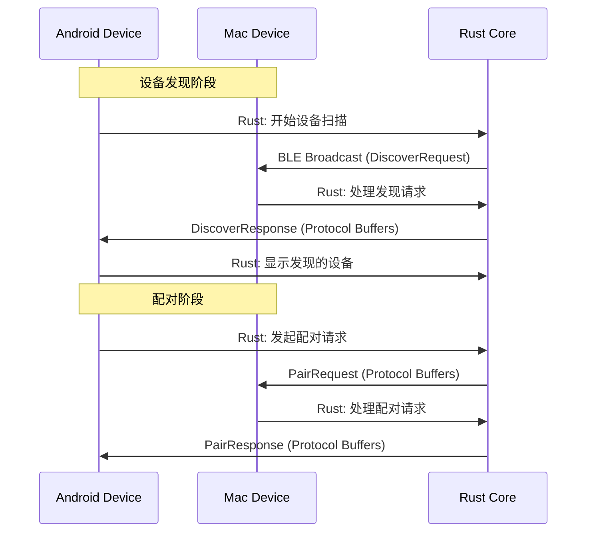
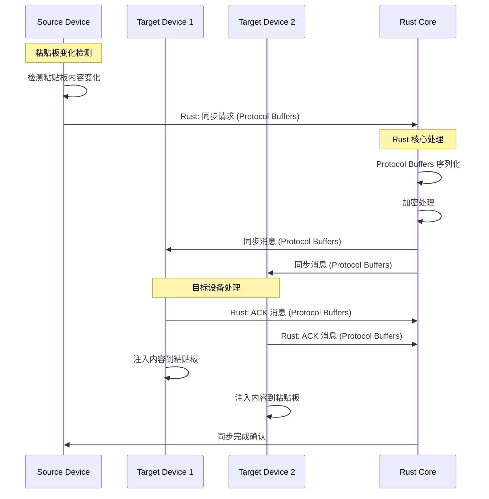

# API 规范

## BLE 通信协议规范

由于 NearClip 使用 BLE 而非传统 REST API，这里定义设备间的 BLE 通信协议：

### Protocol Buffers 消息定义

所有设备间通信使用 Protocol Buffers 格式，确保类型安全和性能优化。

#### 基础消息结构 (.proto)

```protobuf
syntax = "proto3";

package nearclip.protocol;

// 基础消息结构
message BaseMessage {
  string version = 1;           // 协议版本
  MessageType type = 2;         // 消息类型
  string device_id = 3;         // 设备唯一标识
  uint64 timestamp = 4;         // Unix 时间戳
  bytes payload = 5;            // 序列化的具体消息内容
}

enum MessageType {
  MESSAGE_TYPE_UNKNOWN = 0;
  DISCOVER = 1;                // 设备发现
  PAIR_REQUEST = 2;            // 配对请求
  PAIR_RESPONSE = 3;           // 配对响应
  SYNC_MESSAGE = 4;            // 数据同步
  ACK_MESSAGE = 5;             // 确认消息
  ERROR_MESSAGE = 6;           // 错误消息
}

// 设备信息
message DeviceInfo {
  string device_id = 1;
  string device_name = 2;
  DeviceType device_type = 3;
  repeated Capability capabilities = 4;
  string public_key = 5;
}

enum DeviceType {
  DEVICE_TYPE_UNKNOWN = 0;
  ANDROID = 1;
  MAC = 2;
}

enum Capability {
  CAPABILITY_UNKNOWN = 0;
  BLE = 1;
  WIFI_DIRECT = 2;
}
```

#### 设备发现消息

```protobuf
// 设备发现请求
message DiscoverRequest {
  DeviceInfo device_info = 1;
  uint64 scan_duration_ms = 2;  // 扫描持续时间
}

// 设备发现响应
message DiscoverResponse {
  DeviceInfo device_info = 1;
  int32 signal_strength = 2;     // 信号强度 (dBm)
}
```

#### 配对消息

```protobuf
// 配对请求
message PairRequest {
  string target_device_id = 1;
  string pairing_code = 2;      // QR码或手动输入的配对码
  bytes encrypted_payload = 3;   // 加密的配对数据
}

// 配对响应
message PairResponse {
  bool accepted = 1;
  string session_key = 2;       // 会话密钥
  string error_message = 3;      // 错误信息
}
```

#### 数据同步消息

```protobuf
// 同步消息
message SyncMessage {
  string sync_id = 1;           // 同步操作唯一标识
  string content = 2;           // 同步内容
  ContentType content_type = 3; // 内容类型
  repeated string target_devices = 4; // 目标设备列表
}

enum ContentType {
  CONTENT_TYPE_UNKNOWN = 0;
  TEXT = 1;                     // 纯文本
  URL = 2;                      // URL 链接
}
```

#### 确认和错误消息

```protobuf
// 确认消息
message AckMessage {
  string original_message_id = 1;
  AckStatus status = 2;
  string error_code = 3;
}

enum AckStatus {
  ACK_STATUS_UNKNOWN = 0;
  SUCCESS = 1;
  ERROR = 2;
}

// 错误消息
message ErrorMessage {
  ErrorCode error_code = 1;
  string error_message = 2;
  string original_message_id = 3;
}

enum ErrorCode {
  ERROR_CODE_UNKNOWN = 0;
  INVALID_PROTOCOL = 1;
  DEVICE_NOT_FOUND = 2;
  AUTHENTICATION_FAILED = 3;
  ENCRYPTION_ERROR = 4;
  NETWORK_ERROR = 5;
  TIMEOUT_ERROR = 6;
}
```

### 设备发现流程



### 数据同步流程



## Rust FFI API 规范

### 核心 Rust API

#### 设备管理 API

```rust
// Rust FFI 接口定义
#[repr(C)]
pub struct DeviceInfo {
    pub device_id: *const c_char,
    pub device_name: *const c_char,
    pub device_type: DeviceType,
    pub is_connected: bool,
    pub last_seen: u64,
}

#[repr(C)]
pub enum DeviceType {
    Unknown = 0,
    Android = 1,
    Mac = 2,
}

// 设备发现
#[no_mangle]
pub extern "C" fn nearclip_start_device_scan(
    callback: extern "C" fn(device: *const DeviceInfo)
) -> NearclipResult;

// 设备连接
#[no_mangle]
pub extern "C" fn nearclip_connect_to_device(
    device_id: *const c_char
) -> NearclipResult;

// 设备断开
#[no_mangle]
pub extern "C" fn nearclip_disconnect_device(
    device_id: *const c_char
) -> NearclipResult;
```

#### 数据同步 API

```rust
// 同步消息结构
#[repr(C)]
pub struct SyncMessage {
    pub sync_id: *const c_char,
    pub content: *const c_char,
    pub content_type: ContentType,
    pub target_devices: *const *const c_char,
    pub target_count: usize,
}

// 发送同步消息
#[no_mangle]
pub extern "C" fn nearclip_broadcast_sync(
    message: *const SyncMessage
) -> NearclipResult;

// 设置同步回调
#[no_mangle]
pub extern "C" fn nearclip_set_sync_callback(
    callback: extern "C" fn(message: *const SyncMessage)
) -> NearclipResult;
```

#### 错误处理 API

```rust
#[repr(C)]
pub enum NearclipResult {
    Success = 0,
    InvalidArgument = 1,
    DeviceNotFound = 2,
    ConnectionFailed = 3,
    EncryptionError = 4,
    ProtocolError = 5,
    TimeoutError = 6,
}

// 获取错误信息
#[no_mangle]
pub extern "C" fn nearclip_get_last_error() -> *const c_char;

// 设置错误回调
#[no_mangle]
pub extern "C" fn nearclip_set_error_callback(
    callback: extern "C" fn(error_code: NearclipResult, message: *const c_char)
);
```

### 平台绑定实现

#### Android JNI 绑定

```kotlin
// Kotlin JNI 包装类
class NearClipNative {
    companion object {
        @JvmStatic
        external fun startDeviceScan(callback: DeviceDiscoveryCallback): Int

        @JvmStatic
        external fun connectToDevice(deviceId: String): Int

        @JvmStatic
        external fun broadcastSync(message: SyncMessage): Int
    }
}

interface DeviceDiscoveryCallback {
    fun onDeviceFound(device: DeviceInfo)
}
```

#### macOS C 绑定

```swift
// Swift C 接口绑定
struct NearclipDevice {
    let deviceId: UnsafePointer<Int8>
    let deviceName: UnsafePointer<Int8>
    let deviceType: NearclipDeviceType
    let isConnected: Bool
    let lastSeen: UInt64
}

// Rust 函数声明
@_silgen_name("nearclip_start_device_scan")
func nearclip_start_device_scan(_ callback: @convention(c) (UnsafePointer<NearclipDevice>) -> Void) -> NearclipResult

@_silgen_name("nearclip_connect_to_device")
func nearclip_connect_to_device(_ deviceId: UnsafePointer<Int8>) -> NearclipResult
```

## Protocol Buffers 代码生成

### 生成命令

```bash
# 生成 Rust 代码
protoc --rust_out=src/shared/rust/src/generated/ \
       --rust_opt=generate_accessors \
       src/shared/protocol/*.proto

# 生成 Kotlin 代码
protoc --kotlin_out=src/platform/android/app/src/main/java/ \
       src/shared/protocol/*.proto

# 生成 Swift 代码
protoc --swift_out=src/platform/mac/NearClip/Sources/Generated/ \
       src/shared/protocol/*.proto
```

### 版本兼容性

Protocol Buffers 支持向前和向后兼容：

- **新增字段**: 老版本忽略新字段
- **删除字段**: 新版本设置默认值
- **修改字段类型**: 需要谨慎，建议使用新字段名
- **枚举值**: 只能添加新的枚举值，不能删除或重用
