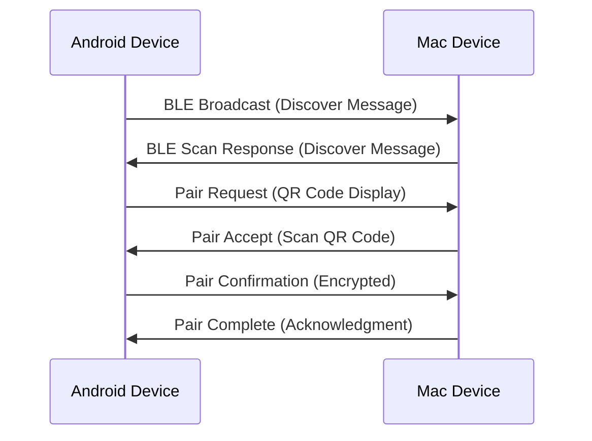
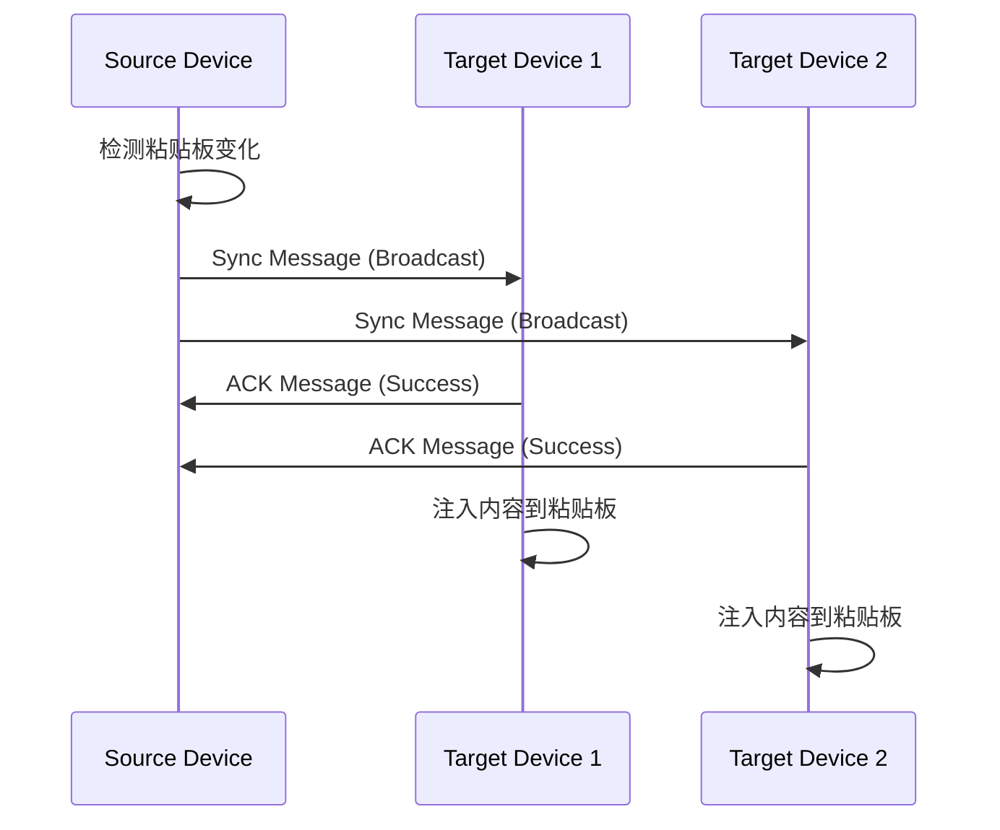

# API 规范

## BLE 通信协议规范

由于 NearClip 使用 BLE 而非传统 REST API，这里定义设备间的 BLE 通信协议：

### 消息格式标准

```yaml
# 基础消息结构
message:
  version: "1.0"
  type: "discover|pair|sync|ack|error"
  deviceId: "string"
  timestamp: "unix_timestamp"
  payload: "object"

# 设备发现消息
discover_message:
  type: "discover"
  deviceId: "device_unique_id"
  payload:
    deviceName: "string"
    deviceType: "android|mac"
    capabilities: ["ble", "wifi_direct"]

# 配对请求消息
pair_request:
  type: "pair"
  deviceId: "initiator_device_id"
  payload:
    targetDeviceId: "target_device_id"
    pairingCode: "qr_code_or_manual_code"
    publicKey: "device_public_key"

# 数据同步消息
sync_message:
  type: "sync"
  deviceId: "source_device_id"
  payload:
    content: "synchronized_text_or_url"
    contentType: "text|url"
    syncId: "unique_sync_identifier"
    targetDevices: ["device_id_list"]

# 确认消息
ack_message:
  type: "ack"
  deviceId: "responder_device_id"
  payload:
    originalMessageId: "message_id_to_acknowledge"
    status: "success|error"
    errorCode: "error_code_if_applicable"

# 错误消息
error_message:
  type: "error"
  deviceId: "sender_device_id"
  payload:
    errorCode: "ERROR_CODE"
    errorMessage: "human_readable_error_message"
    originalMessageId: "failed_message_id"
```

### 设备发现流程



### 数据同步流程


