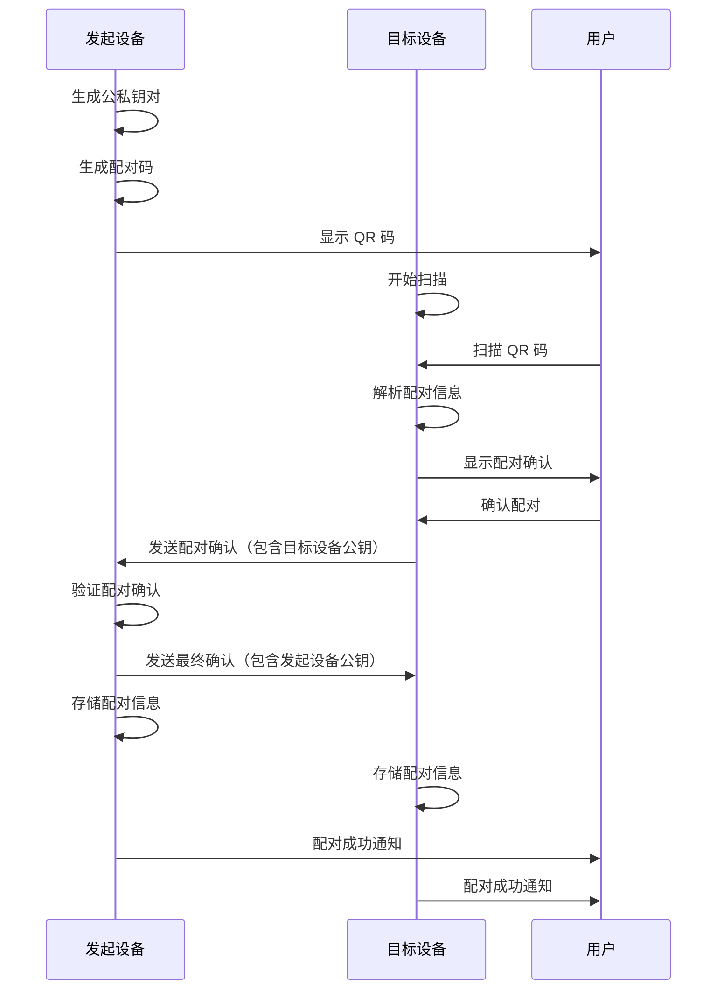

# 后端架构

## 服务架构

由于 NearClip 采用 P2P 架构，每个设备都同时作为客户端和服务端运行。以下是设备端的服务架构：

### 函数组织

```
android/src/main/java/com/nearclip/services/
├── bluetooth/
│   ├── BluetoothManager.kt
│   ├── GattServerManager.kt
│   └── MessageHandler.kt
├── sync/
│   ├── SyncService.kt
│   ├── ConflictResolver.kt
│   └── SyncQueueManager.kt
├── security/
│   ├── EncryptionService.kt
│   ├── KeyManager.kt
│   └── DeviceAuthenticator.kt
└── storage/
    ├── DatabaseService.kt
    └── PreferencesService.kt
```

### 函数模板

```kotlin
class GattServerManager(
    private val context: Context,
    private val messageHandler: MessageHandler
) {
    private val bluetoothManager: BluetoothManager = context.getSystemService(Context.BLUETOOTH_SERVICE) as BluetoothManager
    private val bluetoothAdapter: BluetoothAdapter? = bluetoothManager.adapter
    private var gattServer: BluetoothGattServer? = null

    private val gattServerCallback = object : BluetoothGattServerCallback() {
        override fun onConnectionStateChange(device: BluetoothDevice, status: Int, newState: Int) {
            when (newState) {
                BluetoothProfile.STATE_CONNECTED -> {
                    Log.d(TAG, "Device connected: ${device.address}")
                    handleDeviceConnected(device)
                }
                BluetoothProfile.STATE_DISCONNECTED -> {
                    Log.d(TAG, "Device disconnected: ${device.address}")
                    handleDeviceDisconnected(device)
                }
            }
        }

        override fun onCharacteristicReadRequest(
            device: BluetoothDevice,
            requestId: Int,
            offset: Int,
            characteristic: BluetoothGattCharacteristic
        ) {
            handleReadRequest(device, requestId, characteristic)
        }

        override fun onCharacteristicWriteRequest(
            device: BluetoothDevice,
            requestId: Int,
            characteristic: BluetoothGattCharacteristic,
            preparedWrite: Boolean,
            responseNeeded: Boolean,
            offset: Int,
            value: ByteArray
        ) {
            handleWriteRequest(device, requestId, characteristic, value)
        }
    }

    suspend fun startServer(): Result<Unit> = suspendCoroutine { continuation ->
        gattServer = bluetoothAdapter?.openGattServer(context, gattServerCallback)

        gattServer?.let { server ->
            val service = BluetoothGattService(SERVICE_UUID, BluetoothGattService.SERVICE_TYPE_PRIMARY)

            // 添加同步特征
            val syncCharacteristic = BluetoothGattCharacteristic(
                SYNC_CHARACTERISTIC_UUID,
                BluetoothGattCharacteristic.PROPERTY_WRITE or BluetoothGattCharacteristic.PROPERTY_READ,
                BluetoothGattCharacteristic.PERMISSION_WRITE or BluetoothGattCharacteristic.PERMISSION_READ
            )
            service.addCharacteristic(syncCharacteristic)

            // 添加设备信息特征
            val deviceInfoCharacteristic = BluetoothGattCharacteristic(
                DEVICE_INFO_CHARACTERISTIC_UUID,
                BluetoothGattCharacteristic.PROPERTY_READ,
                BluetoothGattCharacteristic.PERMISSION_READ
            )
            service.addCharacteristic(deviceInfoCharacteristic)

            server.addService(service)
            continuation.resume(Result.success(Unit))
        } ?: continuation.resume(Result.failure(Exception("Failed to start GATT server")))
    }

    private fun handleWriteRequest(
        device: BluetoothDevice,
        requestId: Int,
        characteristic: BluetoothGattCharacteristic,
        value: ByteArray
    ) {
        when (characteristic.uuid) {
            SYNC_CHARACTERISTIC_UUID -> {
                val message = MessageParser.parseMessage(value)
                messageHandler.handleIncomingMessage(device, message)

                gattServer?.sendResponse(
                    device,
                    requestId,
                    BluetoothGatt.GATT_SUCCESS,
                    0,
                    null
                )
            }
            else -> {
                gattServer?.sendResponse(
                    device,
                    requestId,
                    BluetoothGatt.GATT_FAILURE,
                    0,
                    null
                )
            }
        }
    }
}
```

## 数据库架构

### 模式设计

```sql
-- 设备表
CREATE TABLE devices (
    device_id TEXT PRIMARY KEY,
    device_name TEXT NOT NULL,
    device_type TEXT NOT NULL CHECK (device_type IN ('android', 'mac')),
    public_key TEXT NOT NULL UNIQUE,
    last_seen INTEGER NOT NULL DEFAULT (strftime('%s', 'now')),
    connection_status TEXT NOT NULL DEFAULT 'disconnected',
    is_trusted INTEGER NOT NULL DEFAULT 0,
    created_at INTEGER NOT NULL DEFAULT (strftime('%s', 'now')),
    updated_at INTEGER NOT NULL DEFAULT (strftime('%s', 'now'))
);

-- 同步记录表
CREATE TABLE sync_records (
    sync_id TEXT PRIMARY KEY,
    source_device_id TEXT NOT NULL,
    content TEXT NOT NULL,
    content_type TEXT NOT NULL CHECK (content_type IN ('text', 'url')),
    timestamp INTEGER NOT NULL,
    status TEXT NOT NULL DEFAULT 'pending',
    retry_count INTEGER NOT NULL DEFAULT 0,
    created_at INTEGER NOT NULL DEFAULT (strftime('%s', 'now')),
    FOREIGN KEY (source_device_id) REFERENCES devices(device_id) ON DELETE CASCADE
);

-- 设备同步状态表
CREATE TABLE device_sync_status (
    id INTEGER PRIMARY KEY AUTOINCREMENT,
    sync_id TEXT NOT NULL,
    target_device_id TEXT NOT NULL,
    status TEXT NOT NULL DEFAULT 'pending',
    error_message TEXT,
    completed_at INTEGER,
    FOREIGN KEY (sync_id) REFERENCES sync_records(sync_id) ON DELETE CASCADE,
    FOREIGN KEY (target_device_id) REFERENCES devices(device_id) ON DELETE CASCADE,
    UNIQUE(sync_id, target_device_id)
);

-- 配对请求表
CREATE TABLE pairing_requests (
    request_id TEXT PRIMARY KEY,
    initiator_device_id TEXT NOT NULL,
    target_device_id TEXT NOT NULL,
    pairing_code TEXT NOT NULL,
    timestamp INTEGER NOT NULL,
    status TEXT NOT NULL DEFAULT 'pending',
    expires_at INTEGER NOT NULL,
    completed_at INTEGER,
    FOREIGN KEY (initiator_device_id) REFERENCES devices(device_id) ON DELETE CASCADE,
    FOREIGN KEY (target_device_id) REFERENCES devices(device_id) ON DELETE CASCADE
);

-- 应用设置表
CREATE TABLE app_settings (
    key TEXT PRIMARY KEY,
    value TEXT NOT NULL,
    updated_at INTEGER NOT NULL DEFAULT (strftime('%s', 'now'))
);
```

### 数据访问层

```kotlin
@Dao
interface DeviceDao {
    @Query("SELECT * FROM devices ORDER BY last_seen DESC")
    fun getAllDevices(): Flow<List<Device>>

    @Query("SELECT * FROM devices WHERE connection_status = 'connected'")
    fun getConnectedDevices(): Flow<List<Device>>

    @Query("SELECT * FROM devices WHERE device_id = :deviceId")
    suspend fun getDeviceById(deviceId: String): Device?

    @Insert(onConflict = OnConflictStrategy.REPLACE)
    suspend fun insertOrUpdateDevice(device: Device): Long

    @Update
    suspend fun updateDevice(device: Device)

    @Query("DELETE FROM devices WHERE device_id = :deviceId")
    suspend fun deleteDevice(deviceId: String)

    @Query("UPDATE devices SET connection_status = :status, last_seen = :timestamp WHERE device_id = :deviceId")
    suspend fun updateConnectionStatus(deviceId: String, status: String, timestamp: Long = System.currentTimeMillis())
}

@Dao
interface SyncRecordDao {
    @Query("SELECT * FROM sync_records ORDER BY timestamp DESC LIMIT :limit")
    fun getRecentSyncRecords(limit: Int = 100): Flow<List<SyncRecord>>

    @Query("SELECT * FROM sync_records WHERE status = 'pending'")
    suspend fun getPendingSyncRecords(): List<SyncRecord>

    @Insert
    suspend fun insertSyncRecord(syncRecord: SyncRecord): Long

    @Update
    suspend fun updateSyncRecord(syncRecord: SyncRecord)

    @Query("UPDATE sync_records SET status = :status WHERE sync_id = :syncId")
    suspend fun updateSyncStatus(syncId: String, status: String)

    @Query("DELETE FROM sync_records WHERE timestamp < :beforeTimestamp")
    suspend fun deleteOldRecords(beforeTimestamp: Long)
}

@Repository
class DeviceRepository @Inject constructor(
    private val deviceDao: DeviceDao,
    private val syncRecordDao: SyncRecordDao
) {
    val allDevices: Flow<List<Device>> = deviceDao.getAllDevices()
    val connectedDevices: Flow<List<Device>> = deviceDao.getConnectedDevices()

    suspend fun getDeviceById(deviceId: String): Device? = deviceDao.getDeviceById(deviceId)

    suspend fun saveDevice(device: Device) {
        deviceDao.insertOrUpdateDevice(device.copy(
            updatedAt = System.currentTimeMillis()
        ))
    }

    suspend fun updateConnectionStatus(deviceId: String, status: String) {
        deviceDao.updateConnectionStatus(deviceId, status)
    }

    suspend fun removeDevice(deviceId: String) {
        deviceDao.deleteDevice(deviceId)
    }

    suspend fun saveSyncRecord(syncRecord: SyncRecord) {
        syncRecordDao.insertSyncRecord(syncRecord)
    }

    suspend fun getPendingSyncRecords(): List<SyncRecord> {
        return syncRecordDao.getPendingSyncRecords()
    }
}
```

## 认证和授权架构

### 认证流程



### 中间件/守卫

```kotlin
class SecurityMiddleware {
    private val keyManager: KeyManager = TODO()
    private val deviceRepository: DeviceRepository = TODO()

    suspend fun validateIncomingMessage(
        device: BluetoothDevice,
        message: NearClipMessage
    ): Result<Unit> {
        return try {
            // 验证设备是否已配对
            val knownDevice = deviceRepository.getDeviceById(device.address)
            if (knownDevice == null) {
                return Result.failure(SecurityException("Unknown device"))
            }

            // 验证消息签名
            val isValidSignature = verifyMessageSignature(
                message = message,
                signature = message.signature,
                publicKey = knownDevice.publicKey
            )

            if (!isValidSignature) {
                return Result.failure(SecurityException("Invalid message signature"))
            }

            // 验证消息时间戳（防重放攻击）
            val messageAge = System.currentTimeMillis() - message.timestamp
            if (messageAge > MESSAGE_MAX_AGE_MS) {
                return Result.failure(SecurityException("Message too old"))
            }

            Result.success(Unit)
        } catch (error: Exception) {
            Result.failure(error)
        }
    }

    private suspend fun verifyMessageSignature(
        message: NearClipMessage,
        signature: String,
        publicKey: String
    ): Boolean {
        return keyManager.verifySignature(
            data = message.serializeWithoutSignature(),
            signature = signature,
            publicKey = publicKey
        )
    }
}

class PairingGuard {
    private val keyManager: KeyManager = TODO()
    private val deviceRepository: DeviceRepository = TODO()

    suspend fun initiatePairing(targetDevice: BluetoothDevice): Result<String> {
        return try {
            // 生成临时配对信息
            val pairingCode = generateSecurePairingCode()
            val ephemeralKeypair = keyManager.generateEphemeralKeypair()

            // 存储配对请求
            val pairingRequest = PairingRequest(
                requestId = UUID.randomUUID().toString(),
                initiatorDeviceId = getCurrentDeviceId(),
                targetDeviceId = targetDevice.address,
                pairingCode = pairingCode,
                timestamp = System.currentTimeMillis(),
                status = PairingStatus.PENDING,
                expiresAt = System.currentTimeMillis() + PAIRING_REQUEST_TIMEOUT_MS
            )

            // 发送配对请求
            val pairMessage = PairMessage(
                requestId = pairingRequest.requestId,
                initiatorDeviceId = getCurrentDeviceId(),
                pairingCode = pairingCode,
                publicKey = ephemeralKeypair.publicKey,
                timestamp = System.currentTimeMillis()
            )

            bluetoothService.sendMessage(targetDevice, pairMessage)

            Result.success(pairingCode)
        } catch (error: Exception) {
            Result.failure(error)
        }
    }

    suspend fun handlePairingResponse(
        message: PairResponseMessage
    ): Result<Unit> {
        return try {
            // 验证配对响应
            val pairingRequest = getPendingPairingRequest(message.requestId)
            if (pairingRequest == null) {
                return Result.failure(SecurityException("Unknown pairing request"))
            }

            if (pairingRequest.expiresAt < System.currentTimeMillis()) {
                return Result.failure(SecurityException("Pairing request expired"))
            }

            // 验证响应签名
            val isValidSignature = securityMiddleware.validateIncomingMessage(
                device = getDeviceById(message.initiatorDeviceId)!!,
                message = message
            )

            if (!isValidSignature) {
                return Result.failure(SecurityException("Invalid pairing response"))
            }

            // 完成配对
            val trustedDevice = Device(
                deviceId = message.initiatorDeviceId,
                deviceName = message.deviceName,
                deviceType = message.deviceType,
                publicKey = message.publicKey,
                lastSeen = System.currentTimeMillis(),
                connectionStatus = ConnectionStatus.PAIRED,
                isTrusted = true
            )

            deviceRepository.saveDevice(trustedDevice)

            Result.success(Unit)
        } catch (error: Exception) {
            Result.failure(error)
        }
    }
}
```
