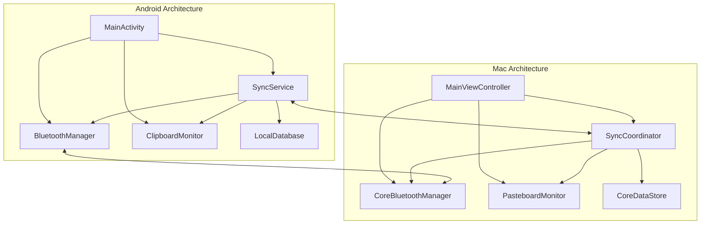

# 组件

## Rust 共享逻辑库组件

### 核心通信引擎 (Core Communication Engine)

**职责：** 统一的 BLE 通信管理，确保跨平台行为一致性。

**关键接口：**
```rust
pub struct BleEngine {
    // 设备发现
    pub fn start_discovery(&self, callback: DeviceCallback) -> Result<(), BleError>;
    pub fn stop_discovery(&self) -> Result<(), BleError>;

    // 设备连接
    pub fn connect_to_device(&self, device_id: &str) -> Result<(), BleError>;
    pub fn disconnect_device(&self, device_id: &str) -> Result<(), BleError>;

    // 消息传输
    pub fn send_message(&self, device_id: &str, message: &[u8]) -> Result<(), BleError>;
    pub fn set_message_callback(&self, callback: MessageCallback);
}

pub type DeviceCallback = extern "C" fn(device: *const DeviceInfo);
pub type MessageCallback = extern "C" fn(device_id: *const c_char, message: *const u8, len: usize);
```

**技术栈：** Rust + btleplug + tokio

### Protocol Buffers 处理器 (Protocol Buffers Processor)

**职责：** 统一的序列化/反序列化，确保跨平台数据格式一致。

**关键接口：**
```rust
pub struct ProtocolProcessor {
    pub fn serialize_message<T: protobuf::Message>(&self, msg: &T) -> Result<Vec<u8>, ProtocolError>;
    pub fn deserialize_message<T: protobuf::Message>(&self, data: &[u8]) -> Result<T, ProtocolError>;
    pub fn validate_message(&self, data: &[u8], message_type: MessageType) -> bool;
}
```

**技术栈：** Rust + prost + protobuf

### 安全与加密模块 (Security & Encryption Module)

**职责：** 设备配对验证、端到端加密、密钥管理。

**关键接口：**
```rust
pub struct SecurityManager {
    pub fn generate_key_pair(&self) -> Result<KeyPair, CryptoError>;
    pub fn encrypt_message(&self, data: &[u8], public_key: &[u8]) -> Result<Vec<u8>, CryptoError>;
    pub fn decrypt_message(&self, encrypted_data: &[u8]) -> Result<Vec<u8>, CryptoError>;
    pub fn verify_device(&self, device_id: &str, signature: &[u8]) -> bool;
}
```

**技术栈：** Rust + ring + ed25519-dalek

### 设备管理器 (Device Manager)

**职责：** 设备状态管理、连接状态跟踪、设备信息缓存。

**关键接口：**
```rust
pub struct DeviceManager {
    pub fn add_device(&mut self, device: Device) -> Result<(), DeviceError>;
    pub fn remove_device(&mut self, device_id: &str) -> Result<(), DeviceError>;
    pub fn get_device(&self, device_id: &str) -> Option<&Device>;
    pub fn get_connected_devices(&self) -> Vec<&Device>;
    pub fn update_device_status(&mut self, device_id: &str, status: ConnectionStatus) -> Result<(), DeviceError>;
}
```

**技术栈：** Rust + std::collections

## Android 端组件 (FFI 调用层)

### RustNativeBridge

**职责：** Android 平台与 Rust 核心库之间的 JNI 桥接。

**关键接口：**
```kotlin
class RustNativeBridge {
    companion object {
        @JvmStatic
        external fun initializeNearclip(): Int

        @JvmStatic
        external fun startDeviceDiscovery(callback: DeviceDiscoveryCallback): Int

        @JvmStatic
        external fun connectToDevice(deviceId: String): Int

        @JvmStatic
        external fun sendSyncMessage(deviceId: String, content: ByteArray): Int

        @JvmStatic
        external fun setSyncCallback(callback: SyncCallback)

        @JvmStatic
        external fun getLastError(): String
    }
}
```

**依赖：** Rust 共享逻辑库
**技术栈：** Kotlin + JNI

### ClipboardMonitor

**职责：** 监听系统粘贴板变化，调用 Rust 库进行同步。

**关键接口：**
```kotlin
class ClipboardMonitor(private val rustBridge: RustNativeBridge) {
    fun startMonitoring()
    fun stopMonitoring()
    fun getCurrentContent(): String
    private fun onClipboardChanged(content: String)
}
```

**依赖：** Android ClipboardManager, RustNativeBridge
**技术栈：** Kotlin + ClipboardManager + ContentObserver

### NearClipUIManager

**职责：** 管理 UI 状态，与 Rust 库交互。

**关键接口：**
```kotlin
class NearClipUIManager {
    fun refreshDeviceList()
    fun connectToDevice(deviceId: String)
    fun showSyncStatus(status: SyncStatus)
    fun handleError(error: NearclipError)
}
```

**依赖：** RustNativeBridge, Jetpack Compose
**技术栈：** Kotlin + Jetpack Compose + ViewModel

## Mac 端组件

### CoreBluetoothManager

**职责：** 管理 macOS 设备的 BLE 功能，实现与 Android 端对应的通信能力。

**关键接口：**
- startScanning(): Promise<Device[]>
- startAdvertising(): Promise<void>
- connectToPeripheral(deviceId: string): Promise<void>
- disconnectPeripheral(deviceId: string): Promise<void>

**依赖：** Core Bluetooth 框架
**技术栈：** Swift + CoreBluetooth + CBCentralManager

### PasteboardMonitor

**职责：** 监听系统粘贴板变化，与 Android 端保持一致的监听逻辑。

**关键接口：**
- startMonitoring(): void
- stopMonitoring(): void
- getCurrentContent(): Promise<string>
- onContentChanged: Callback<string>

**依赖：** NSPasteboard
**技术栈：** Swift + NSPasteboard + NSNotificationCenter

### SyncCoordinator

**职责：** 协调 Mac 端的同步操作，管理与 Android 端的数据交换。

**关键接口：**
- handleIncomingSync(message: SyncMessage): Promise<void>
- initiateSync(content: string): Promise<void>
- manageSyncHistory(): SyncRecord[]

**依赖：** CoreBluetoothManager, Core Data
**技术栈：** Swift + Core Data + Combine Framework

## 组件图


