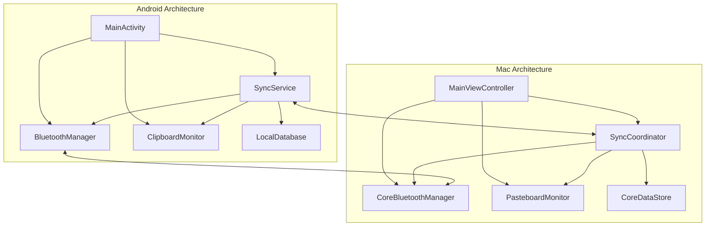

# 组件

## Android 端组件

### BluetoothManager

**职责：** 管理 Android 设备的 BLE 功能，包括设备扫描、广播、连接管理。

**关键接口：**
- startDiscovery(): Promise<Device[]>
- startAdvertising(): Promise<void>
- connectToDevice(deviceId: string): Promise<void>
- disconnectFromDevice(deviceId: Promise<void>

**依赖：** Android BLE API
**技术栈：** Kotlin + BluetoothAdapter + BluetoothLeScanner

### ClipboardMonitor

**职责：** 监听系统粘贴板变化，捕获新的文本内容。

**关键接口：**
- startMonitoring(): void
- stopMonitoring(): void
- getCurrentContent(): Promise<string>
- onContentChanged: Callback<string>

**依赖：** Android ClipboardManager
**技术栈：** Kotlin + ClipboardManager + ContentObserver

### SyncService

**职责：** 处理跨设备数据同步逻辑，包括消息发送、接收和冲突解决。

**关键接口：**
- broadcastSync(content: string, targets: Device[]): Promise<void>
- handleSyncMessage(message: SyncMessage): Promise<void>
- resolveConflict(conflicts: SyncRecord[]): SyncRecord

**依赖：** BluetoothManager, LocalStorage
**技术栈：** Kotlin + Coroutines + Room Database

## Mac 端组件

### CoreBluetoothManager

**职责：** 管理 macOS 设备的 BLE 功能，实现与 Android 端对应的通信能力。

**关键接口：**
- startScanning(): Promise<Device[]>
- startAdvertising(): Promise<void>
- connectToPeripheral(deviceId: string): Promise<void>
- disconnectPeripheral(deviceId: string): Promise<void>

**依赖：** Core Bluetooth 框架
**技术栈：** Swift + CoreBluetooth + CBCentralManager

### PasteboardMonitor

**职责：** 监听系统粘贴板变化，与 Android 端保持一致的监听逻辑。

**关键接口：**
- startMonitoring(): void
- stopMonitoring(): void
- getCurrentContent(): Promise<string>
- onContentChanged: Callback<string>

**依赖：** NSPasteboard
**技术栈：** Swift + NSPasteboard + NSNotificationCenter

### SyncCoordinator

**职责：** 协调 Mac 端的同步操作，管理与 Android 端的数据交换。

**关键接口：**
- handleIncomingSync(message: SyncMessage): Promise<void>
- initiateSync(content: string): Promise<void>
- manageSyncHistory(): SyncRecord[]

**依赖：** CoreBluetoothManager, Core Data
**技术栈：** Swift + Core Data + Combine Framework

## 组件图

