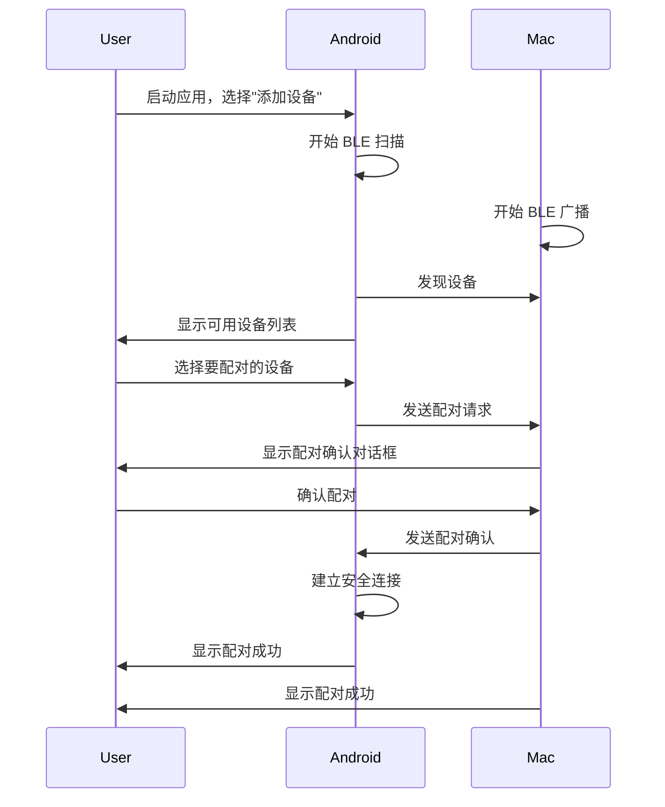
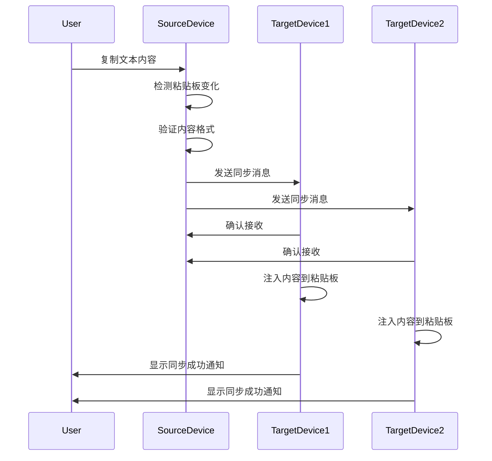
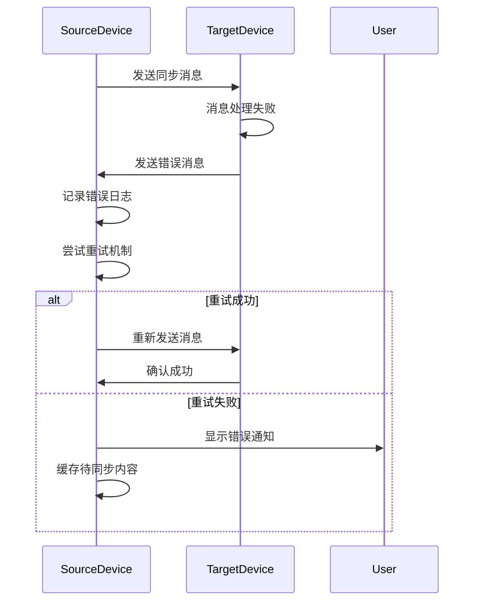

# 核心工作流

## 设备配对工作流

```mermaid
sequenceDiagram
    participant User
    participant Android
    participant Mac

    User->>Android: 启动应用，选择"添加设备"
    Android->>Android: 开始 BLE 扫描
    Mac->>Mac: 开始 BLE 广播
    Android->>Mac: 发现设备
    Android->>User: 显示可用设备列表
    User->>Android: 选择要配对的设备
    Android->>Mac: 发送配对请求
    Mac->>User: 显示配对确认对话框
    User->>Mac: 确认配对
    Mac->>Android: 发送配对确认
    Android->>Android: 建立安全连接
    Android->>User: 显示配对成功
    Mac->>User: 显示配对成功
```

## 粘贴板同步工作流

```mermaid
sequenceDiagram
    participant User
    participant SourceDevice
    participant TargetDevice1
    participant TargetDevice2

    User->>SourceDevice: 复制文本内容
    SourceDevice->>SourceDevice: 检测粘贴板变化
    SourceDevice->>SourceDevice: 验证内容格式
    SourceDevice->>TargetDevice1: 发送同步消息
    SourceDevice->>TargetDevice2: 发送同步消息
    TargetDevice1->>SourceDevice: 确认接收
    TargetDevice2->>SourceDevice: 确认接收
    TargetDevice1->>TargetDevice1: 注入内容到粘贴板
    TargetDevice2->>TargetDevice2: 注入内容到粘贴板
    TargetDevice1->>User: 显示同步成功通知
    TargetDevice2->>User: 显示同步成功通知
```

## 错误处理工作流

```mermaid
sequenceDiagram
    participant SourceDevice
    participant TargetDevice
    participant User

    SourceDevice->>TargetDevice: 发送同步消息
    TargetDevice->>TargetDevice: 消息处理失败
    TargetDevice->>SourceDevice: 发送错误消息
    SourceDevice->>SourceDevice: 记录错误日志
    SourceDevice->>SourceDevice: 尝试重试机制
    alt 重试成功
        SourceDevice->>TargetDevice: 重新发送消息
        TargetDevice->>SourceDevice: 确认成功
    else 重试失败
        SourceDevice->>User: 显示错误通知
        SourceDevice->>SourceDevice: 缓存待同步内容
    end
```
