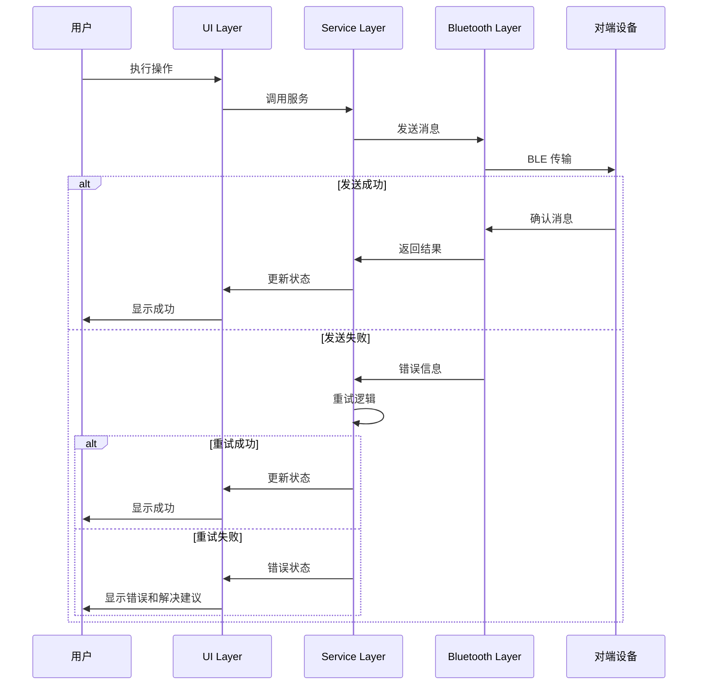

# 错误处理策略

## 错误流



## 错误响应格式

```typescript
interface ApiError {
  error: {
    code: string;
    message: string;
    details?: Record<string, any>;
    timestamp: number;
    requestId: string;
  };
}
```

## 前端错误处理

```kotlin
@Composable
fun ErrorBoundary(
    error: String?,
    onRetry: () -> Unit,
    onDismiss: () -> Unit
) {
    if (error != null) {
        AlertDialog(
            onDismissRequest = onDismiss,
            title = { Text("操作失败") },
            text = {
                Column {
                    Text(error)
                    Spacer(modifier = Modifier.height(8.dp))
                    Text("请检查设备连接状态后重试")
                }
            },
            confirmButton = {
                TextButton(onClick = onRetry) {
                    Text("重试")
                }
            },
            dismissButton = {
                TextButton(onClick = onDismiss) {
                    Text("取消")
                }
            }
        )
    }
}

class NearClipViewModel : ViewModel() {
    private val _error = MutableStateFlow<String?>(null)
    val error: StateFlow<String?> = _error.asStateFlow()

    fun clearError() {
        _error.value = null
    }

    private fun handleError(error: Throwable) {
        val errorMessage = when (error) {
            is BluetoothException -> "蓝牙连接失败: ${error.message}"
            is SyncException -> "同步失败: ${error.message}"
            is SecurityException -> "安全验证失败: ${error.message}"
            else -> "未知错误: ${error.message}"
        }

        _error.value = errorMessage
    }
}
```

## 后端错误处理

```kotlin
sealed class NearClipException(message: String, cause: Throwable? = null) : Exception(message, cause) {
    class BluetoothException(message: String, cause: Throwable? = null) : NearClipException(message, cause)
    class SyncException(message: String, cause: Throwable? = null) : NearClipException(message, cause)
    class SecurityException(message: String, cause: Throwable? = null) : NearClipException(message, cause)
    class ValidationException(message: String) : NearClipException(message)
}

class ErrorHandler {
    fun handleError(error: Throwable): NearClipException {
        return when (error) {
            is IOException -> NearClipException.BluetoothException("网络连接失败", error)
            is SecurityException -> NearClipException.SecurityException("安全验证失败", error)
            is JsonSyntaxException -> NearClipException.ValidationException("消息格式错误")
            else -> NearClipException("未知错误: ${error.message}", error)
        }
    }
}

class SyncServiceImpl : SyncService {
    private val errorHandler = ErrorHandler()
    private val retryPolicy = ExponentialBackoffRetry(
        maxRetries = 3,
        initialDelayMs = 1000,
        maxDelayMs = 5000
    )

    override suspend fun broadcastSync(
        content: String,
        targetDevices: List<Device>
    ): Result<Unit> {
        return retryPolicy.execute {
            try {
                targetDevices.forEach { device ->
                    val result = bluetoothService.sendMessage(device, syncMessage)
                    if (!result.isSuccess) {
                        throw result.exceptionOrNull() ?: Exception("发送失败")
                    }
                }
                Result.success(Unit)
            } catch (error: Throwable) {
                val nearClipError = errorHandler.handleError(error)
                Result.failure(nearClipError)
            }
        }
    }
}
```
