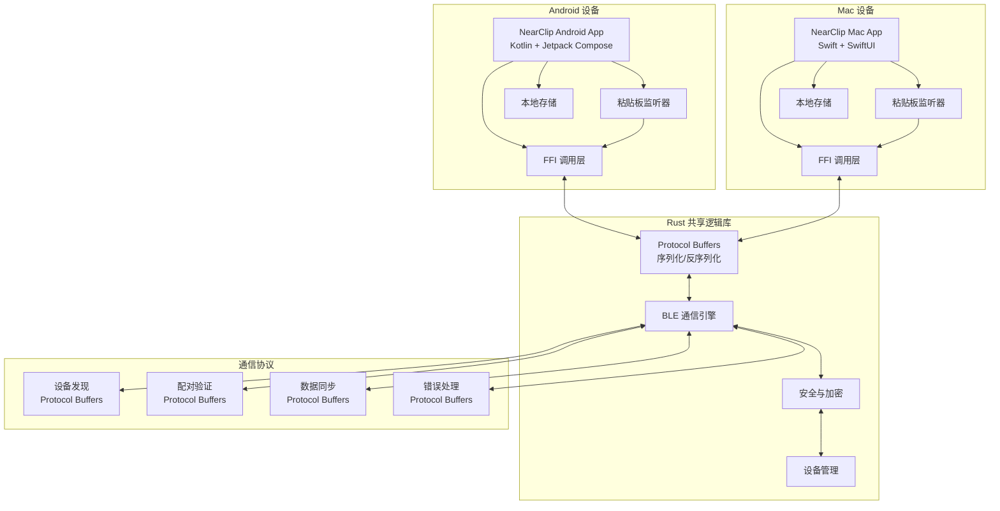

# 高层次架构

## 技术摘要

NearClip 采用去中心化的 P2P 架构，使用 BLE（低功耗蓝牙）作为主要通信协议，WiFi Direct 作为备用方案。系统基于 Kotlin（Android）、Swift（macOS）和 Rust（共享逻辑）的多语言架构，通过 Protocol Buffers 实现设备间的高性能、类型安全数据同步。Monorepo 结构便于共享核心通信协议和 Rust 库，确保跨平台一致性和性能优化。

## 平台和基础设施选择

**平台：** 本地 P2P 通信，无云服务依赖
**核心服务：** Rust 共享逻辑库、Protocol Buffers、BLE 广播/扫描、本地加密存储
**部署主机和区域：** 本地设备部署，无地理限制

## 仓库结构

**结构：** Monorepo
**Monorepo 工具：** 原生 Git + src/platform/* 分层结构
**包组织：** 按平台分离的目录结构，Rust 共享核心逻辑

## 高层次架构图

## 架构模式

- **P2P 去中心化架构**：无中心服务器，每个设备既是客户端也是服务端 - _理由：_ 符合隐私优先原则，避免单点故障
- **多层架构模式**：UI 层 → FFI 层 → Rust 逻辑层 → 协议层 - _理由：_ 清晰的职责分离，便于测试和维护
- **事件驱动通信**：基于粘贴板变化事件的自动同步机制 - _理由：_ 实现无感知同步的用户体验
- **状态机模式**：设备连接状态的精确管理 - _理由：_ 确保连接稳定性和错误恢复
- **策略模式**：BLE/WiFi Direct 通信协议的动态选择 - _理由：_ 根据设备能力和环境条件优化连接质量
- **观察者模式**：粘贴板变化的监听和通知 - _理由：_ 实现实时的内容捕获和同步
- **工厂模式**：Protocol Buffers 消息的标准化创建 - _理由：_ 确保不同平台间的消息格式一致性
- **代理模式**：FFI 层作为 Rust 逻辑的代理 - _理由：_ 隐藏底层 Rust 实现的复杂性

## 跨语言集成架构

### FFI (Foreign Function Interface) 层
- **Android**: JNI (Java Native Interface) 连接 Kotlin ↔ Rust
- **macOS**: C ABI 连接 Swift ↔ Rust
- **统一接口**: 所有平台通过相同的 Rust API 获得一致的行为

### Protocol Buffers 集成
- **定义**: .proto 文件定义跨平台消息格式
- **代码生成**: 自动生成各语言的序列化代码
- **类型安全**: 编译时类型检查，减少运行时错误
- **版本兼容**: 支持协议演化和向后兼容

### 性能优化
- **零拷贝**: Rust 内存管理优化数据传输
- **异步处理**: 非阻塞 I/O 提升响应性能
- **内存安全**: Rust 保证内存安全，避免常见漏洞
