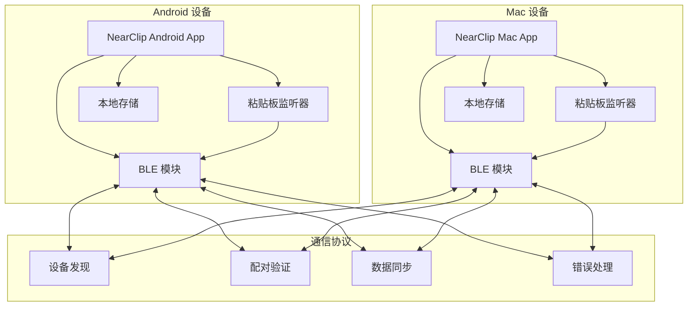

# 高层次架构

## 技术摘要

NearClip 采用去中心化的 P2P 架构，使用 BLE（低功耗蓝牙）作为主要通信协议，WiFi Direct 作为备用方案。系统基于 Kotlin（Android）和 Swift（macOS）的原生开发，通过标准化的 JSON 协议实现设备间的安全数据同步。Monorepo 结构便于共享核心通信协议和测试工具，确保跨平台一致性。

## 平台和基础设施选择

**平台：** 本地 P2P 通信，无云服务依赖
**核心服务：** BLE 广播/扫描、WiFi Direct、本地加密存储
**部署主机和区域：** 本地设备部署，无地理限制

## 仓库结构

**结构：** Monorepo
**Monorepo 工具：** 原生 Git + 共享协议目录
**包组织：** 按平台分离的目录结构，共享核心通信协议

## 高层次架构图

## 架构模式

- **P2P 去中心化架构**：无中心服务器，每个设备既是客户端也是服务端 - _理由：_ 符合隐私优先原则，避免单点故障
- **事件驱动通信**：基于粘贴板变化事件的自动同步机制 - _理由：_ 实现无感知同步的用户体验
- **状态机模式**：设备连接状态的精确管理 - _理由：_ 确保连接稳定性和错误恢复
- **策略模式**：BLE/WiFi Direct 通信协议的动态选择 - _理由：_ 根据设备能力和环境条件优化连接质量
- **观察者模式**：粘贴板变化的监听和通知 - _理由：_ 实现实时的内容捕获和同步
- **工厂模式**：跨平台消息的标准化创建 - _理由：_ 确保不同平台间的消息格式一致性
